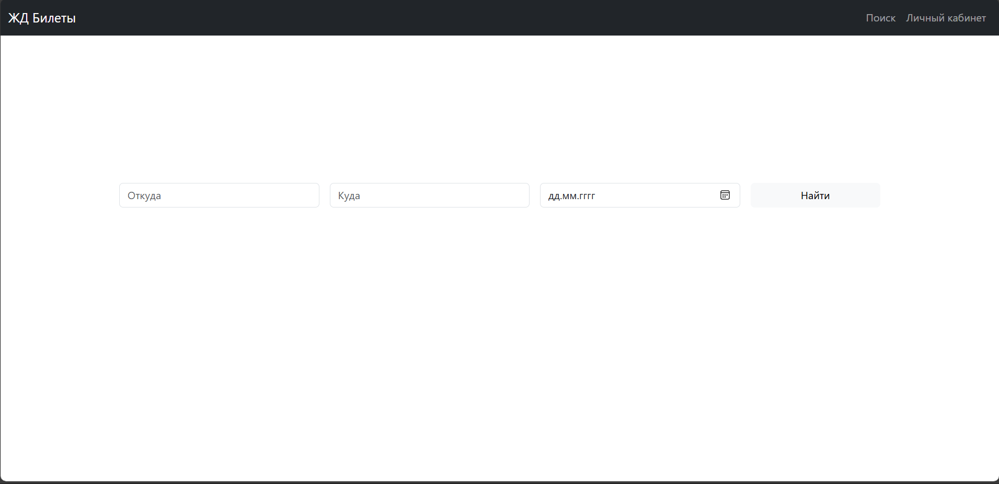
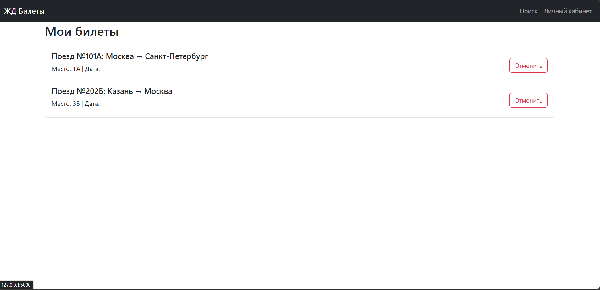
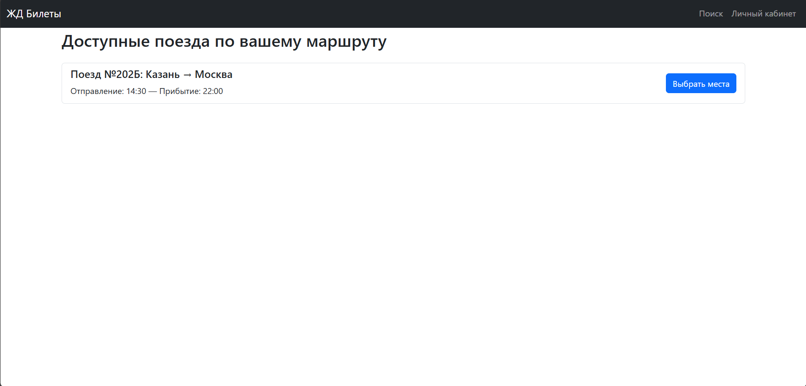
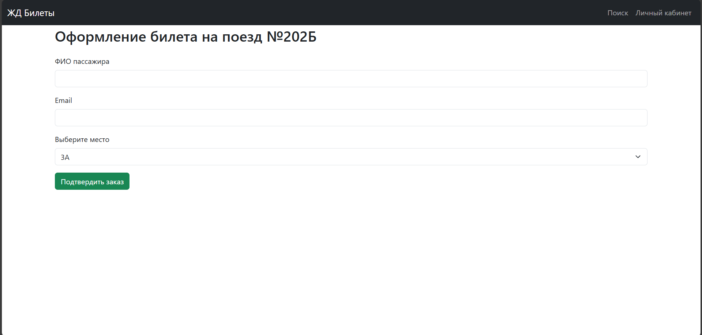

# Лабораторная работа №3
 По дисциплине «Графический интерфейс интеллектуальных систем»

## Тема: "Создание высокоуровневого макета сайта"

**Выполнил:**
Студент 3 курса, группы ИИ-23  
Бусень А.Д.

**Проверила:**
Ситковец Я.С.

## Задание

Задача: сайт представляет собой макет высокого уровня без
функциональной части. Реализовать возможность демонстрации работы
сайта, заполняя поля необходимой информацией и демонстрируя переходы
между страницами сайта.

1. Сайт купли-продажи билетов на ЖД. 
Основные страницы:  
• Главная страница: Поиск маршрутов по направлениям, даты и времени.
 • Результаты поиска: Список доступных поездов с возможностью выбора 
мест.
 • Подтверждение заказа: Форма для ввода данных пассажира и оформления 
билета.
 • Личный кабинет: Просмотр истории поездок или возврат билетов.

1. Главное меню с бронированием билетов

2. Личный кабинет

3. Подбор доступных билетов 

4. Оформление билета

