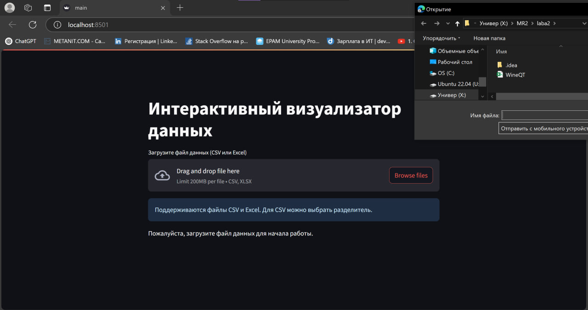
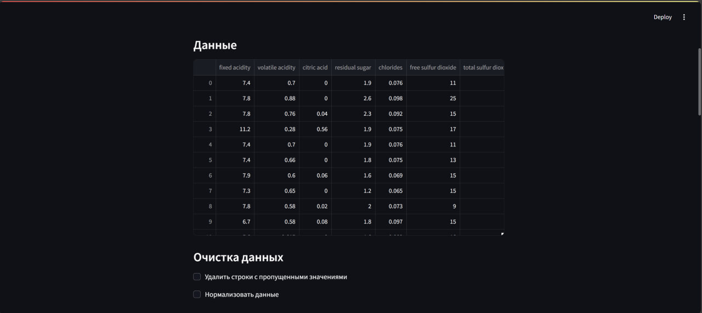
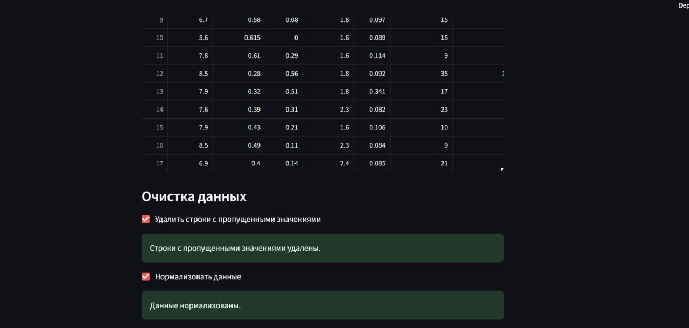
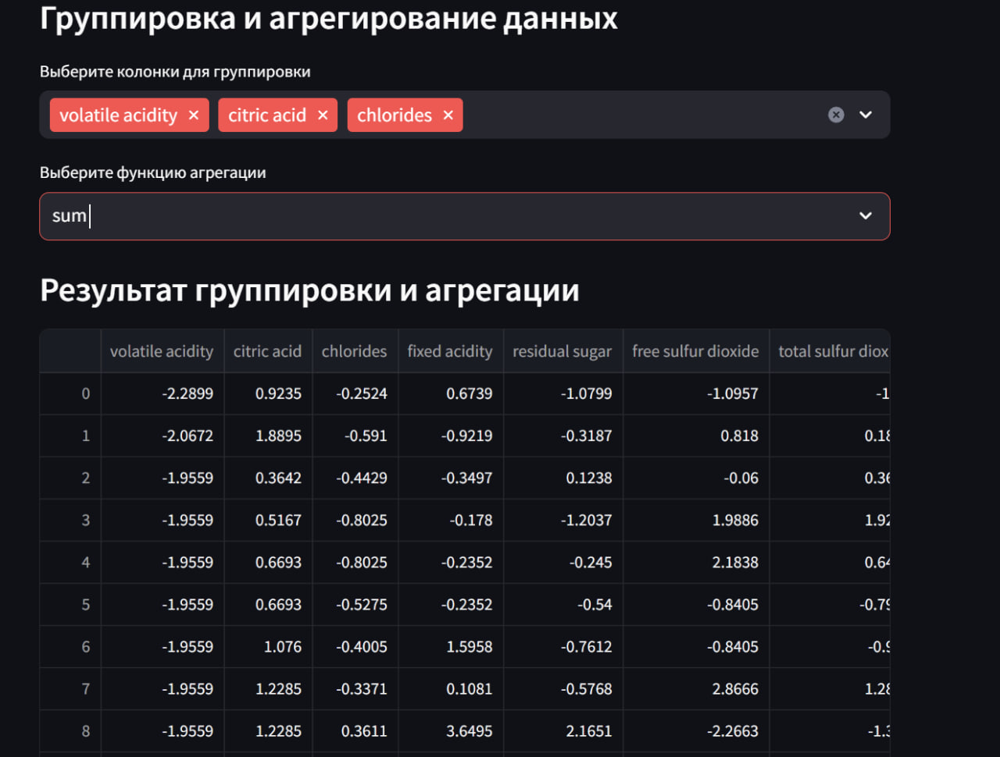
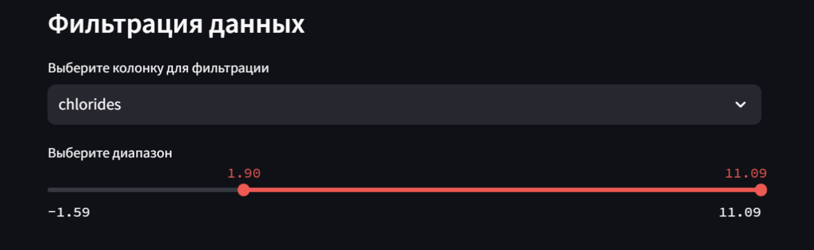
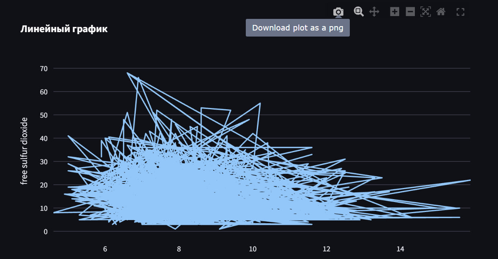
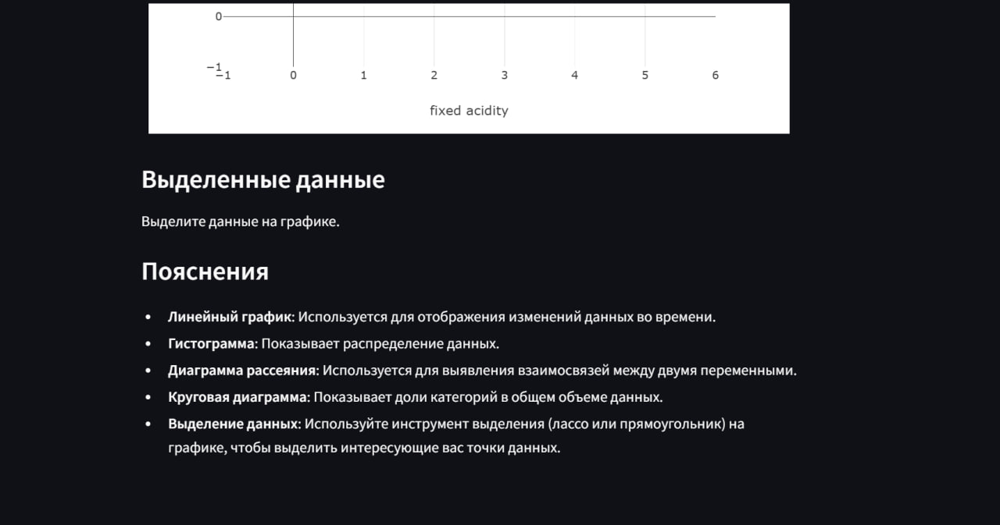
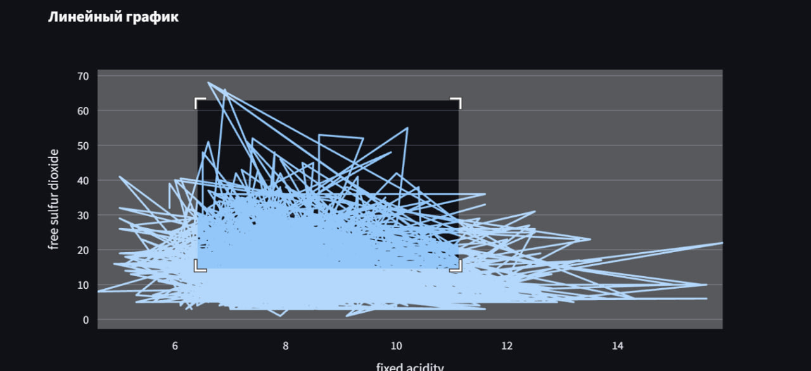
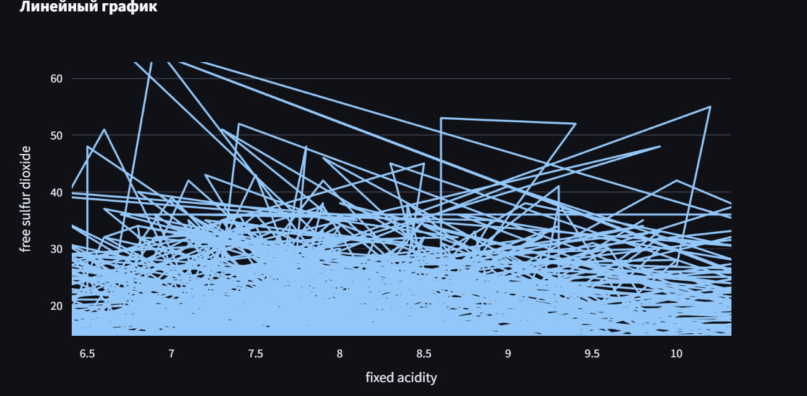
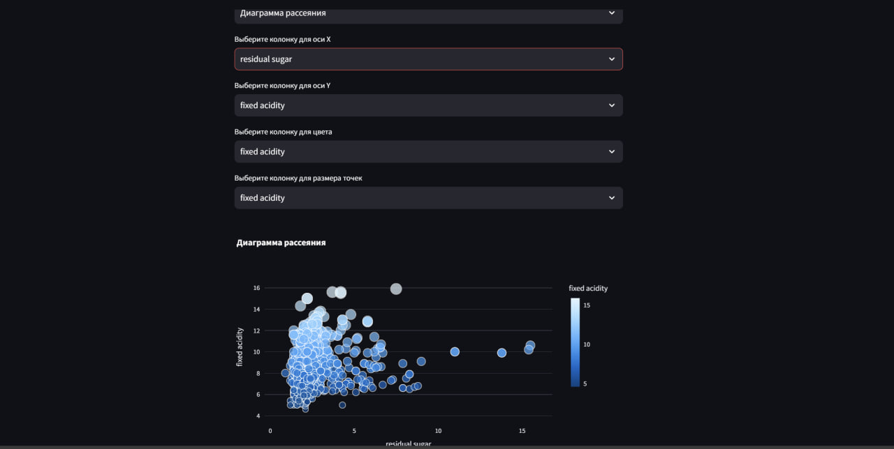

# Лабораторная работа 2

## Тема: "Интерактивный визуализатор данных"

## Цель работы

 Загрузка данных в табличном формате и отображение результатов в виде графиков и диаграмм для последующего анализа

## Основные требования

1. Интерфейс пользователя:
    - Возможность загрузки файлов данных (например, CSV, Excel).
    - Меню для выбора типов визуализации (линейные графики, гистограммы, диаграммы рассеяния и т.д.).
    - Интерактивные элементы управления (фильтры, ползунки, выпадающие списки и т.д.) для изменения параметров визуализации.
2. Обработка данных:
    - Импорт данных из загруженных файлов + визуализация данных в форме таблицы.
    - Обработка и очистка данных (например, устранение пропущенных значений, нормализация).
    - Возможность группировки и агрегирования данных.
3. Алгоритмы визуализации:
    - Реализация различных типов визуализаций (линейные графики, гистограммы, диаграммы рассеяния, круговые диаграммы и т.д.).
    - Возможность динамического обновления визуализаций при изменении параметров.
    - Интерактивные графики (увеличение, уменьшение, выделение отдельных элементов).
4. Функциональные возможности:
    - Возможность экспорта визуализаций в виде изображений (PNG, JPEG) или PDF.
    - Встроенные пояснения и подсказки для пользователей.

    
Оценка работы:
Для оценки работы в 4-5 баллов, нужно выполнить все Зеленые пункты.
Для оценки работы в 7-8 баллов, нужно дополнительно выполнить Бирюзовые пункты. Их всего 4, можно взять любые 3. 
Для оценки в 9-10 нужно выполнить Фиолетовые пункты. Их всего 2.
Итоговая оценка за работу складывается из числа выполненных требований к работе. Обязательными считаются зеленые, все остальные повышают итоговую оценку за работу. 

 

## Код программы

```
import streamlit as st
import pandas as pd
import plotly.express as px
from streamlit_plotly_events import plotly_events


st.title("Интерактивный визуализатор данных")

uploaded_file = st.file_uploader("Загрузите файл данных (CSV или Excel)", type=["csv", "xlsx"])

st.info("Поддерживаются файлы CSV и Excel. Для CSV можно выбрать разделитель.")

if uploaded_file and uploaded_file.name.endswith('.csv'):
    delimiter = st.text_input("Введите разделитель для CSV-файла (по умолчанию запятая)", ",")
else:
    delimiter = ","

if uploaded_file is not None:
    if uploaded_file.name.endswith('.csv'):
        df = pd.read_csv(uploaded_file, delimiter=delimiter)
    else:
        df = pd.read_excel(uploaded_file, engine='openpyxl')

    st.write("### Данные")
    st.write(df)

    st.write("### Очистка данных")
    if st.checkbox("Удалить строки с пропущенными значениями"):
        df = df.dropna()
        st.success("Строки с пропущенными значениями удалены.")
    if st.checkbox("Нормализовать данные"):
        df = (df - df.mean()) / df.std()
        st.success("Данные нормализованы.")

    st.write("### Группировка и агрегирование данных")
    group_by = st.multiselect("Выберите колонки для группировки", df.columns.tolist())
    if group_by:
        agg_func = st.selectbox("Выберите функцию агрегации", ["sum", "mean", "count", "min", "max"])
        df_grouped = df.groupby(group_by).agg(agg_func).reset_index()
        st.write("### Результат группировки и агрегации")
        st.write(df_grouped)
        df = df_grouped

    st.write("### Фильтрация данных")
    filter_column = st.selectbox("Выберите колонку для фильтрации", df.columns.tolist())
    if df[filter_column].dtype in ["int64", "float64"]:
        min_val, max_val = float(df[filter_column].min()), float(df[filter_column].max())
        filter_range = st.slider("Выберите диапазон", min_val, max_val, (min_val, max_val))
        df = df[(df[filter_column] >= filter_range[0]) & (df[filter_column] <= filter_range[1])]
    else:
        filter_value = st.selectbox("Выберите значение для фильтрации", df[filter_column].unique())
        df = df[df[filter_column] == filter_value]

    st.write("### Выбор типа визуализации")
    chart_type = st.selectbox(
        "Выберите тип визуализации",
        ["Линейный график", "Гистограмма", "Диаграмма рассеяния", "Круговая диаграмма"]
    )

    columns = df.columns.tolist()
    x_axis = st.selectbox("Выберите колонку для оси X", columns)
    y_axis = st.selectbox("Выберите колонку для оси Y", columns) if chart_type != "Круговая диаграмма" else None

    if chart_type == "Диаграмма рассеяния":
        color_column = st.selectbox("Выберите колонку для цвета", columns)
        size_column = st.selectbox("Выберите колонку для размера точек", columns)
    else:
        color_column = None
        size_column = None

    if chart_type == "Линейный график":
        fig = px.line(df, x=x_axis, y=y_axis, title="Линейный график")
    elif chart_type == "Гистограмма":
        fig = px.histogram(df, x=x_axis, title="Гистограмма")
    elif chart_type == "Диаграмма рассеяния":
        fig = px.scatter(df, x=x_axis, y=y_axis, color=color_column, size=size_column, title="Диаграмма рассеяния")
    elif chart_type == "Круговая диаграмма":
        fig = px.pie(df, names=x_axis, title="Круговая диаграмма")

    st.plotly_chart(fig)

    selected_points = plotly_events(fig, select_event=True)

    st.write("### Выделенные данные")
    if selected_points:
        selected_indices = [p["pointIndex"] for p in selected_points]
        selected_data = df.iloc[selected_indices]
        st.write(selected_data)
    else:
        st.write("Выделите данные на графике.")

    st.write("### Пояснения")
    st.markdown("""
    - **Линейный график**: Используется для отображения изменений данных во времени.
    - **Гистограмма**: Показывает распределение данных.
    - **Диаграмма рассеяния**: Используется для выявления взаимосвязей между двумя переменными.
    - **Круговая диаграмма**: Показывает доли категорий в общем объеме данных.
    - **Выделение данных**: Используйте инструмент выделения (лассо или прямоугольник) на графике, чтобы выделить интересующие вас точки данных.
    """)

else:
    st.write("Пожалуйста, загрузите файл данных для начала работы.")
    
    Запуск: streamlit run main.py

```
 
## Результаты работы

Интерфейс
 
 
 
 
 
 
 
 
 
 
 
 
 
 

