# Лабораторная работа 2

## Тема: "Интерактивный визуализатор данных"

## Цель работы

 Загрузка данных в табличном формате и отображение результатов в виде графиков и диаграмм для последующего анализа

## Основные требования

1. Интерфейс пользователя:
    - Возможность загрузки файлов данных (например, CSV, Excel).
    - Меню для выбора типов визуализации (линейные графики, гистограммы, диаграммы рассеяния и т.д.).
    - Интерактивные элементы управления (фильтры, ползунки, выпадающие списки и т.д.) для изменения параметров визуализации.
2. Обработка данных:
    - Импорт данных из загруженных файлов + визуализация данных в форме таблицы.
    - Обработка и очистка данных (например, устранение пропущенных значений, нормализация).
    - Возможность группировки и агрегирования данных.
3. Алгоритмы визуализации:
    - Реализация различных типов визуализаций (линейные графики, гистограммы, диаграммы рассеяния, круговые диаграммы и т.д.).
    - Возможность динамического обновления визуализаций при изменении параметров.
    - Интерактивные графики (увеличение, уменьшение, выделение отдельных элементов).
4. Функциональные возможности:
    - Возможность экспорта визуализаций в виде изображений (PNG, JPEG) или PDF.
    - Встроенные пояснения и подсказки для пользователей.

    
Оценка работы:
Для оценки работы в 4-5 баллов, нужно выполнить все Зеленые пункты.
Для оценки работы в 7-8 баллов, нужно дополнительно выполнить Бирюзовые пункты. Их всего 4, можно взять любые 3. 
Для оценки в 9-10 нужно выполнить Фиолетовые пункты. Их всего 2.
Итоговая оценка за работу складывается из числа выполненных требований к работе. Обязательными считаются зеленые, все остальные повышают итоговую оценку за работу. 

 

## Код программы

```
import streamlit as st
import pandas as pd
import plotly.express as px
from io import BytesIO

 
st.title("Визуализация данных")

 
uploaded_file = st.file_uploader("Загрузите файл данных (CSV или Excel)", type=["csv", "xlsx"])

if uploaded_file is not None:
    
    if uploaded_file.name.endswith('.csv'):
        df = pd.read_csv(uploaded_file)
    else:
        df = pd.read_excel(uploaded_file)
    st.write("Данные успешно загружены!")

    
    st.write("Редактирование таблицы:")
    edited_df = st.data_editor(df, num_rows="dynamic")  

   
    st.sidebar.header("Очистка данных")
    if st.sidebar.checkbox("Удалить строки с пропущенными значениями"):
        edited_df = edited_df.dropna()
        st.write("Данные после удаления пропущенных значений:")
        st.write(edited_df)

    if st.sidebar.checkbox("Нормализовать данные (минимум-максимум)"):
        numeric_cols = edited_df.select_dtypes(include=['float64', 'int64']).columns
        edited_df[numeric_cols] = (edited_df[numeric_cols] - edited_df[numeric_cols].min()) / (edited_df[numeric_cols].max() - edited_df[numeric_cols].min())
        st.write("Данные после нормализации:")
        st.write(edited_df)

    
    st.sidebar.header("Агрегирующие функции")
    selected_column = st.sidebar.selectbox("Выберите столбец для анализа", edited_df.columns)

    if st.sidebar.button("Применить агрегирование"):
        
        total_records = len(edited_df)  # Количество записей в таблице
        column_non_null_count = edited_df[selected_column].count()  # Количество значений в столбце
        column_min = edited_df[selected_column].min()  # Минимальное значение
        column_max = edited_df[selected_column].max()  # Максимальное значение
        column_mean = edited_df[selected_column].mean()  # Среднее значение
        column_sum = edited_df[selected_column].sum()  # Сумма значений

        
        st.write(f"### Агрегированные данные для столбца '{selected_column}':")
        st.write(f"- **Количество записей в таблице:** {total_records}")
        st.write(f"- **Количество значений в столбце:** {column_non_null_count}")
        st.write(f"- **Минимальное значение:** {column_min}")
        st.write(f"- **Максимальное значение:** {column_max}")
        st.write(f"- **Среднее значение:** {column_mean}")
        st.write(f"- **Сумма значений:** {column_sum}")

    
    chart_type = st.selectbox(
        "Выберите тип визуализации",
        ["Линейный график", "Гистограмма", "Диаграмма рассеяния", "Круговая диаграмма"]
    )

    
    columns = edited_df.columns.tolist()
    x_axis = st.selectbox("Выберите колонку для оси X", columns)
    y_axis = st.selectbox("Выберите колонку для оси Y", columns)

   
    if st.checkbox("Применить фильтр"):
        filter_value = st.slider("Выберите диапазон значений", float(edited_df[y_axis].min()), float(edited_df[y_axis].max()))
        filtered_df = edited_df[edited_df[y_axis] <= filter_value]
    else:
        filtered_df = edited_df

    
    if chart_type == "Линейный график":
        fig = px.line(filtered_df, x=x_axis, y=y_axis, title="Линейный график")
    elif chart_type == "Гистограмма":
        fig = px.histogram(filtered_df, x=x_axis, y=y_axis, title="Гистограмма")
    elif chart_type == "Диаграмма рассеяния":
        fig = px.scatter(filtered_df, x=x_axis, y=y_axis, title="Диаграмма рассеяния")
    elif chart_type == "Круговая диаграмма":
        fig = px.pie(filtered_df, names=x_axis, values=y_axis, title="Круговая диаграмма")

  
    fig.update_layout(
        hovermode="x unified",  
        clickmode="event+select",  
        dragmode="zoom",  
    )

   
    st.plotly_chart(fig, use_container_width=True)

   
    st.sidebar.header("Экспорт графика")
    export_format = st.sidebar.selectbox("Выберите формат экспорта", ["PNG", "JPEG", "PDF"])
    if st.sidebar.button("Экспортировать график"):
        if export_format == "PNG":
            img_bytes = fig.to_image(format="png")
            st.sidebar.download_button(label="Скачать PNG", data=img_bytes, file_name="plot.png", mime="image/png")
        elif export_format == "JPEG":
            img_bytes = fig.to_image(format="jpeg")
            st.sidebar.download_button(label="Скачать JPEG", data=img_bytes, file_name="plot.jpeg", mime="image/jpeg")
        elif export_format == "PDF":
            img_bytes = fig.to_image(format="pdf")
            st.sidebar.download_button(label="Скачать PDF", data=img_bytes, file_name="plot.pdf", mime="application/pdf")

   
    st.sidebar.header("Подсказки")
    st.sidebar.write("1. Загрузите файл данных в формате CSV или Excel.")
    st.sidebar.write("2. Выберите тип визуализации и настройте параметры.")
    st.sidebar.write("3. Используйте фильтры и агрегирование для анализа данных.")
    st.sidebar.write("4. Экспортируйте графики в нужном формате.")

else:
    st.write("Пожалуйста, загрузите файл данных для начала работы.")
    
    Запуск: streamlit run main.py

```
 
## Результаты работы

Интерфейс
 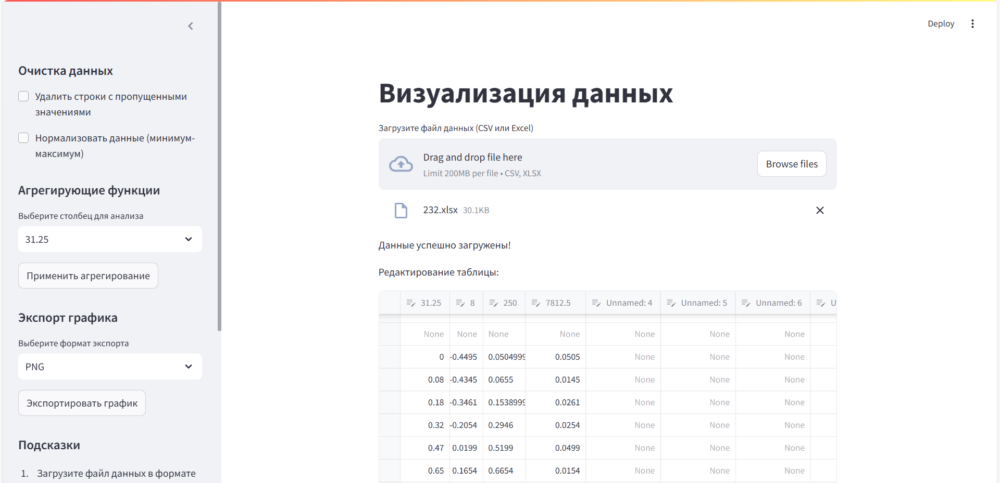
 
1. Интерфейс пользователя:
    - Возможность загрузки файлов данных (например, CSV, Excel).✅
   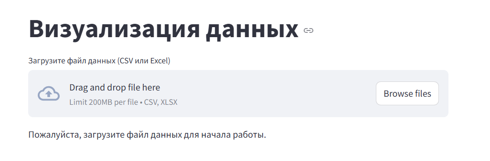
   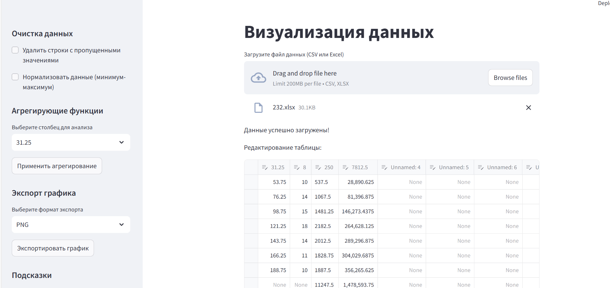
    - Меню для выбора типов визуализации (линейные графики, гистограммы, диаграммы рассеяния и т.д.).✅
   
    - Интерактивные элементы управления (фильтры, ползунки, выпадающие списки и т.д.) для изменения параметров визуализации.✅
   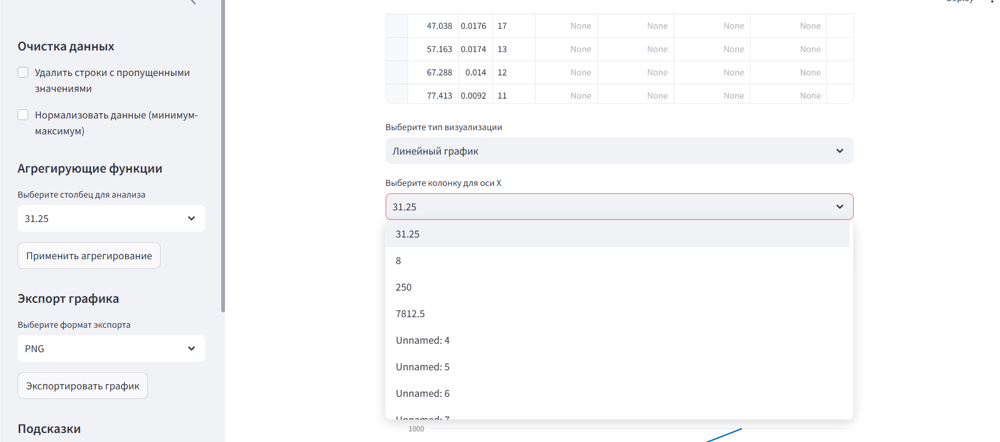
2. Обработка данных:
    - Импорт данных из загруженных файлов + визуализация данных в форме таблицы.✅
   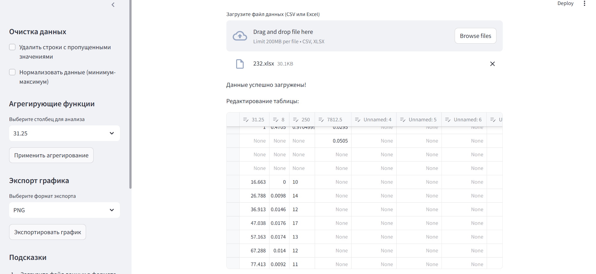
    - Обработка и очистка данных (например, устранение пропущенных значений, нормализация).✅
   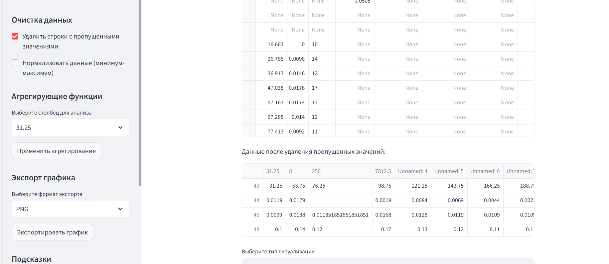
   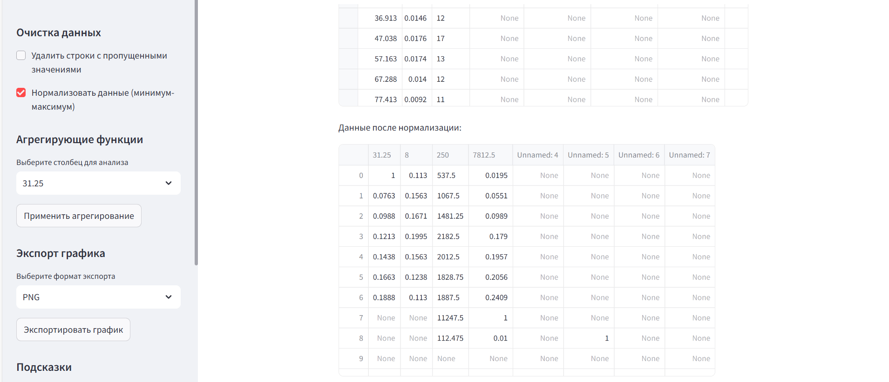
    - Возможность группировки и агрегирования данных.✅
   
3. Алгоритмы визуализации:
    - Реализация различных типов визуализаций (линейные графики, гистограммы, диаграммы рассеяния, круговые диаграммы и т.д.).✅
   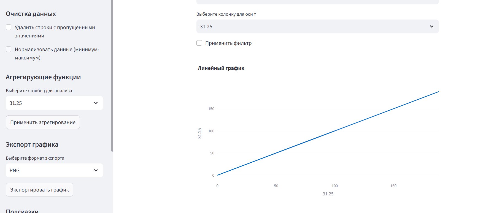
   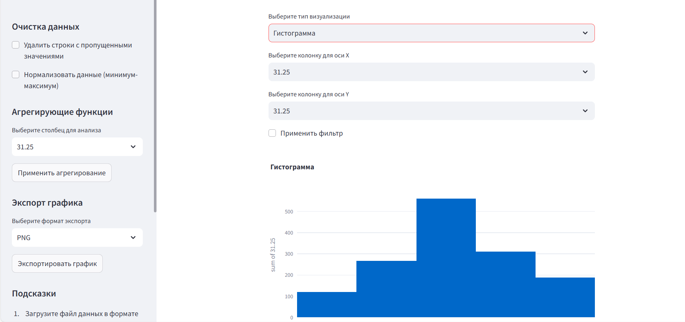
   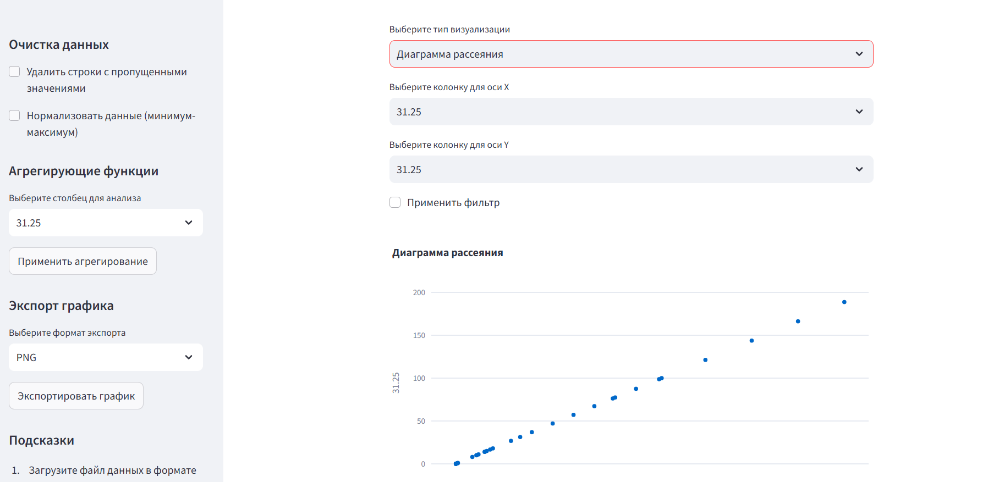
   
    - Возможность динамического обновления визуализаций при изменении параметров.✅
   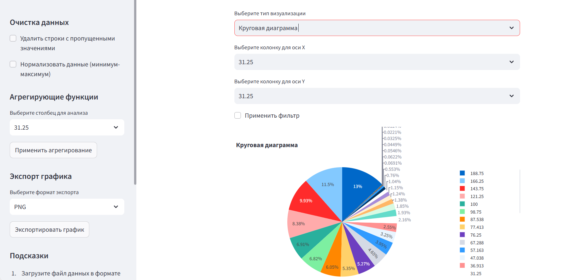
   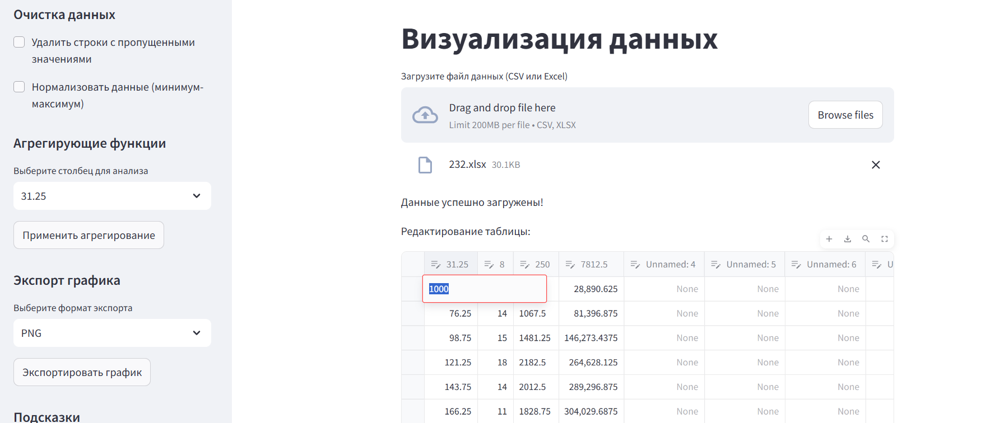
   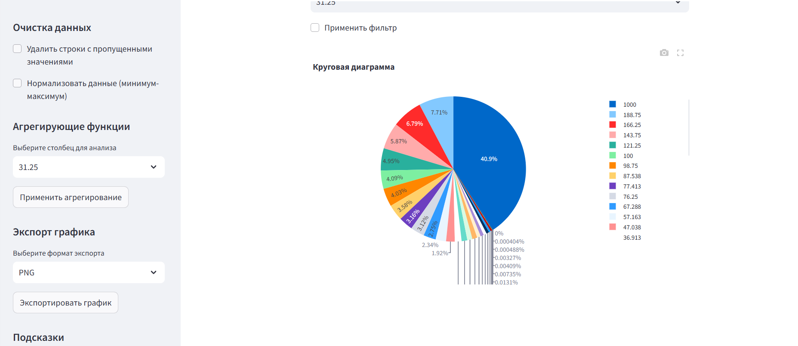
    - Интерактивные графики (увеличение, уменьшение, выделение отдельных элементов).✅
   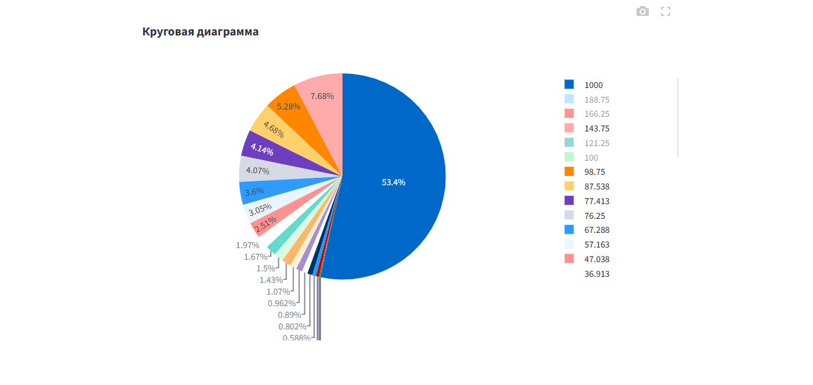
   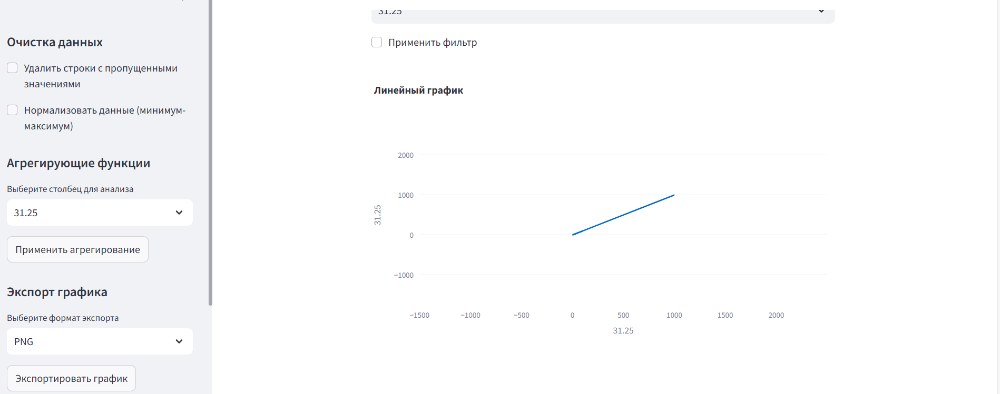
   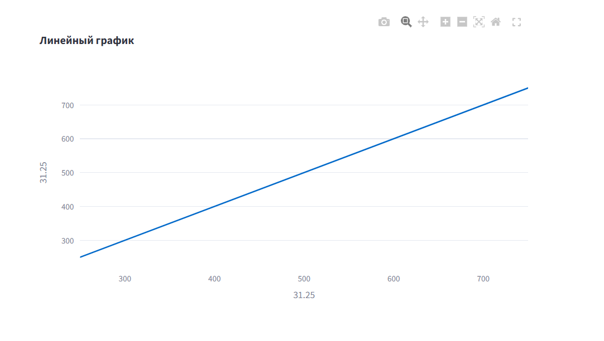
4. Функциональные возможности:
    - Возможность экспорта визуализаций в виде изображений (PNG, JPEG) или PDF.✅
   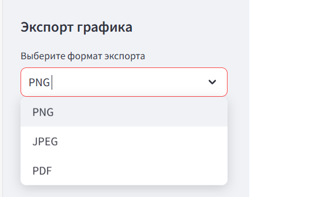
   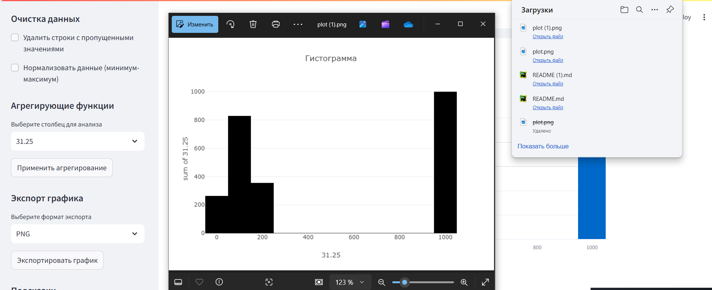
    - Встроенные пояснения и подсказки для пользователей.✅
   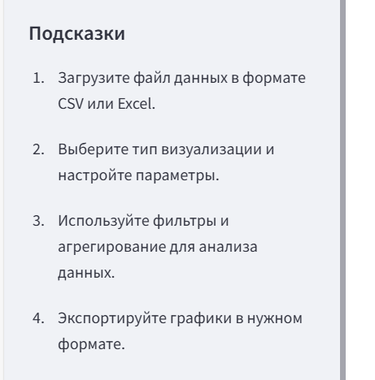
 

