# Лабораторная работа 3

## Тема: "Создание высокоуровневого макета сайта"

## Задача
Задача: сайт представляет собой макет высокого уровня без 
функциональной части. Реализовать возможность демонстрации работы 
сайта, заполняя поля необходимой информацией и демонстрируя переходы 
между страницами сайта

## Вариант 8
Сайт рецептов.

Основные страницы:   
• Главная страница: Список рецептов с возможностью фильтрации по 
ингредиентам, сложности приготовления.  
• Детальная страница рецепта: Полное описание приготовления, список 
ингредиентов, фото готового блюда.  
• Добавление рецепта: Форма для ввода названия рецепта, ингредиентов, 
этапов приготовления, загрузки изображения.  
• Личный кабинет: Список добавленных рецептов и редактирование 
профиля. 
## Результаты работы

1. Главная страница: Список рецептов с возможностью фильтрации по 
ингредиентам, сложности приготовления.
   
Главная страница:
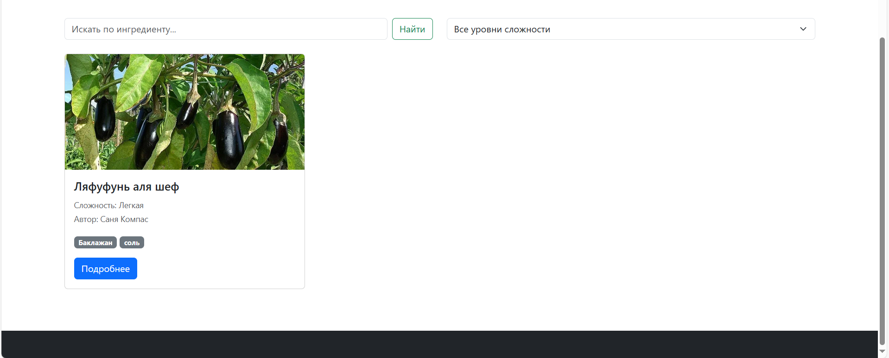
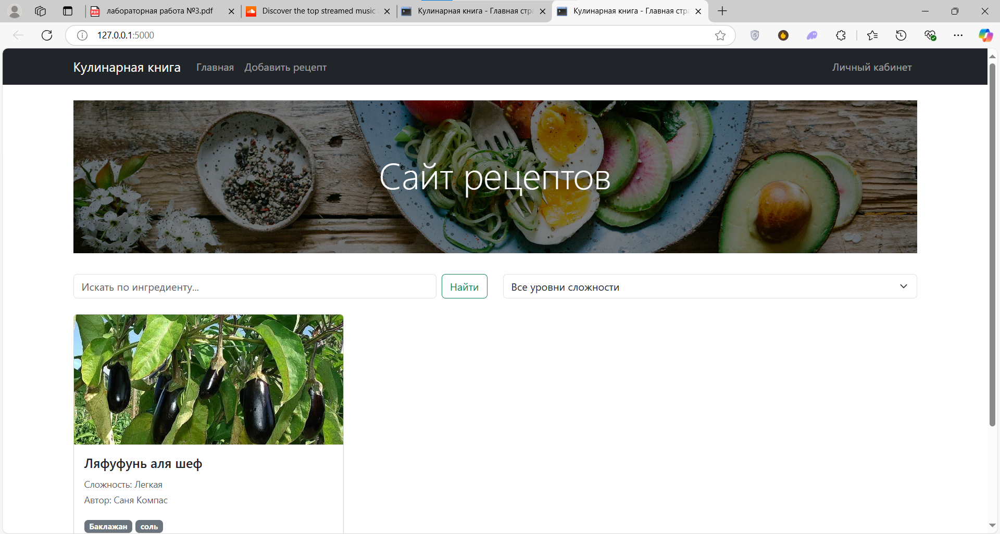

Фильтрация:

Добавил соль:
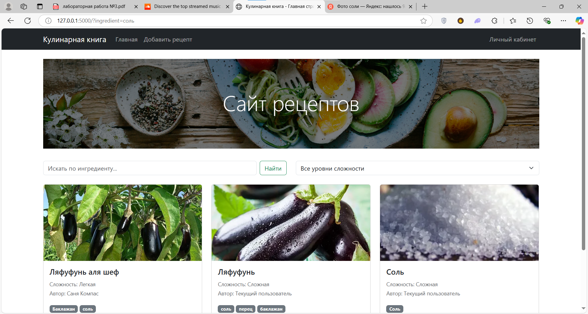

Фильтрация по сложности:
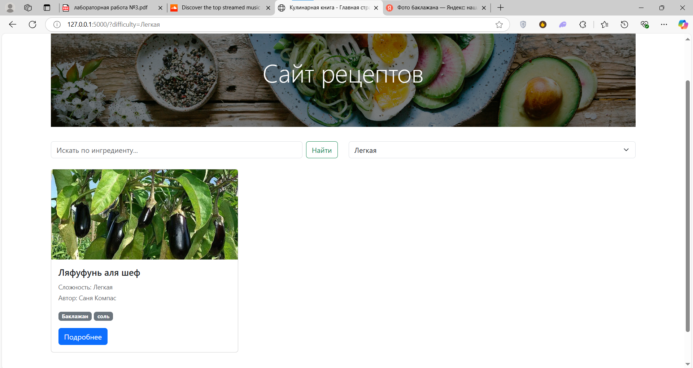

Фильтрация по ингредиентам:
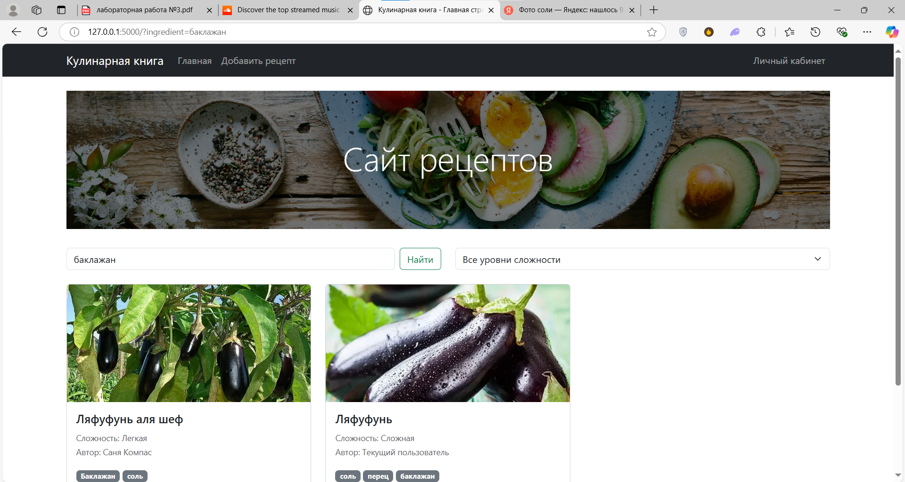

2. Детальная страница рецепта: Полное описание приготовления, список 
ингредиентов, фото готового блюда:
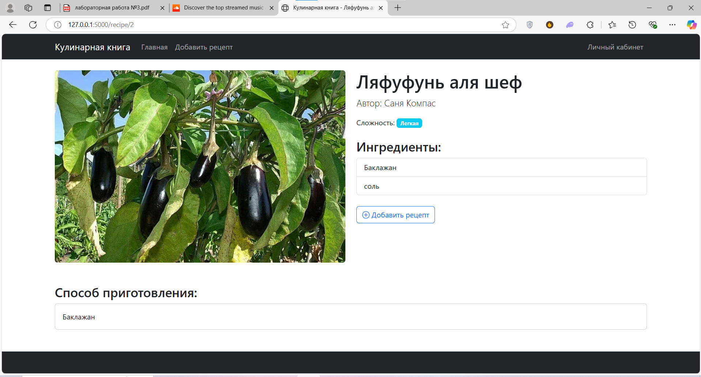

3. Добавление рецепта: Форма для ввода названия рецепта, ингредиентов, 
этапов приготовления, загрузки изображения:
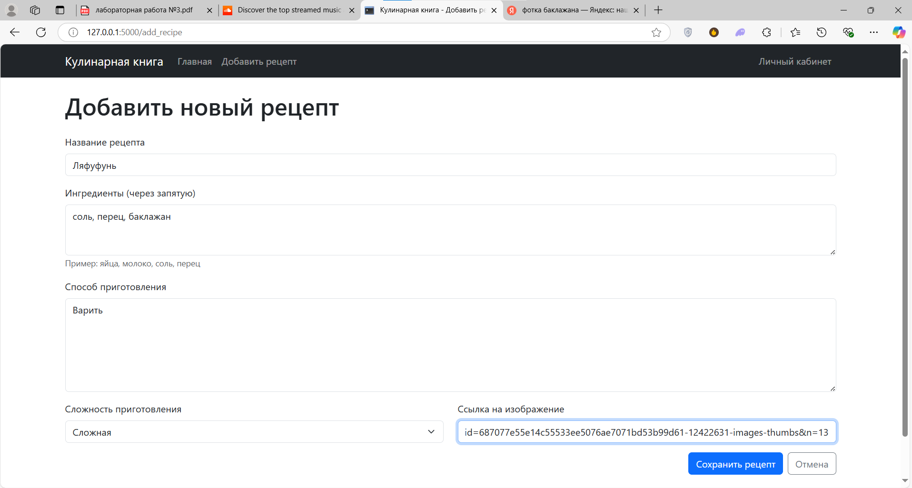
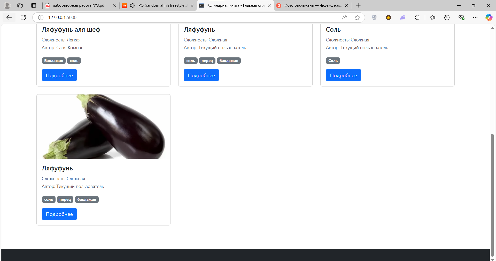
4.  Личный кабинет: Список добавленных рецептов и редактирование 
профиля:
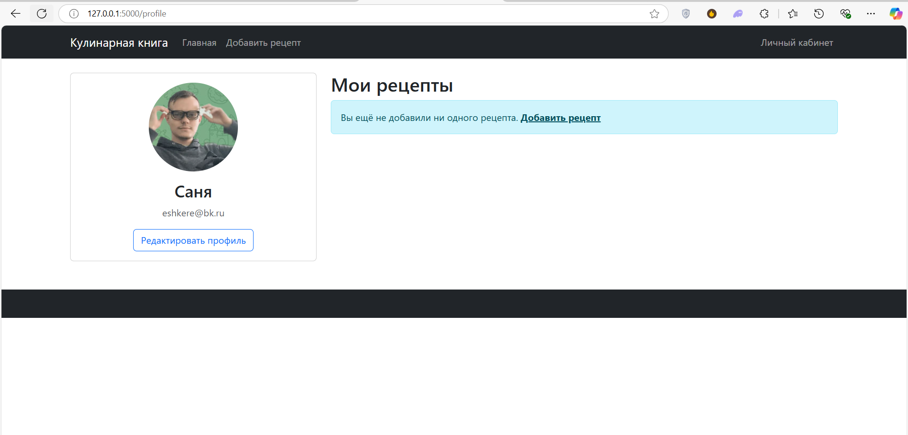

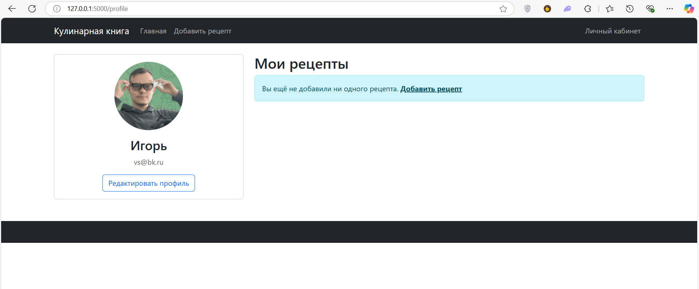
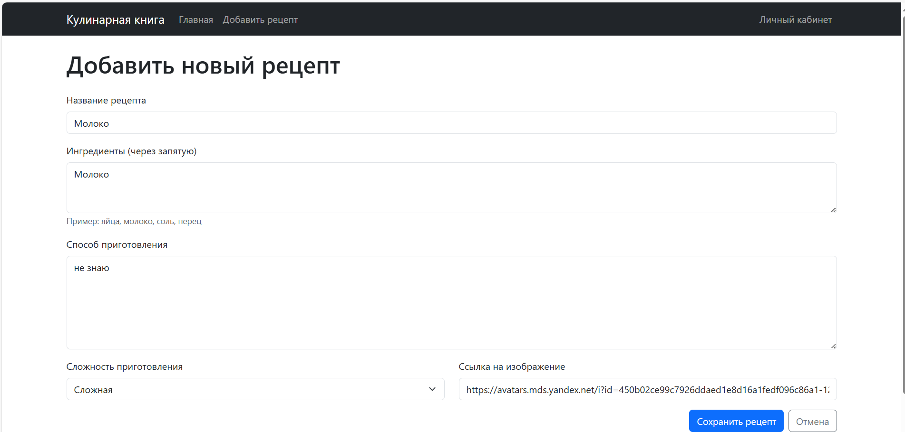
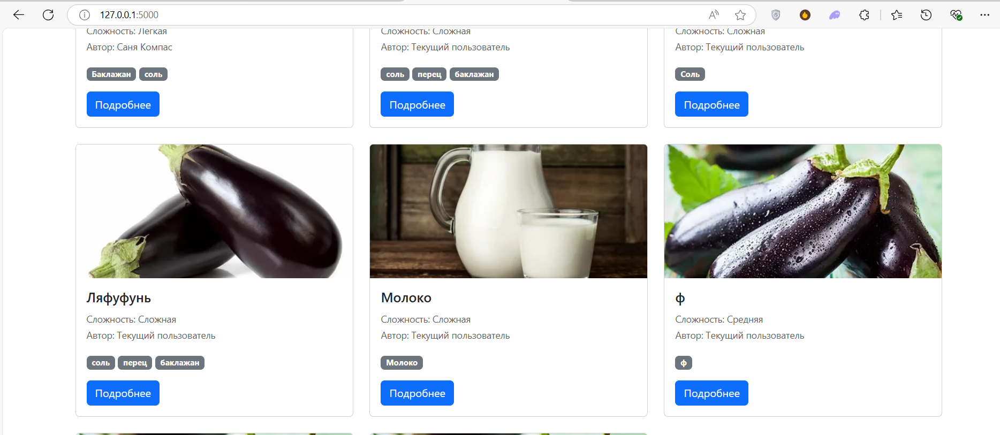

