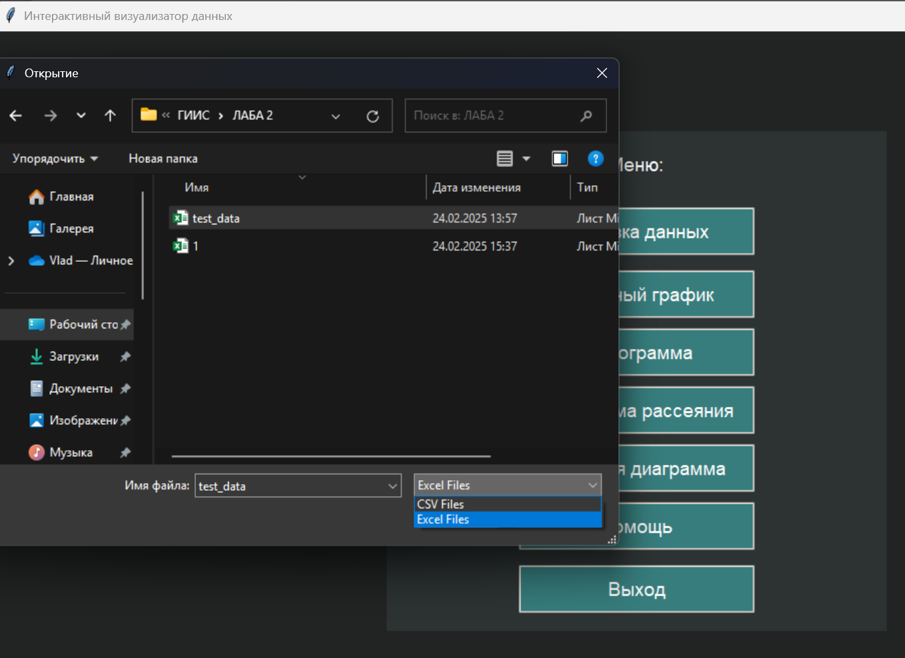
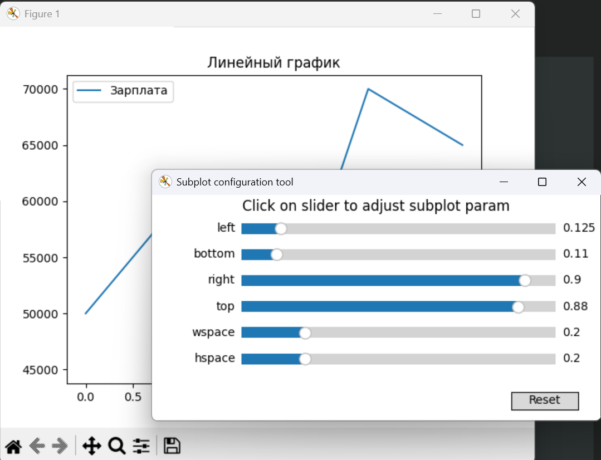
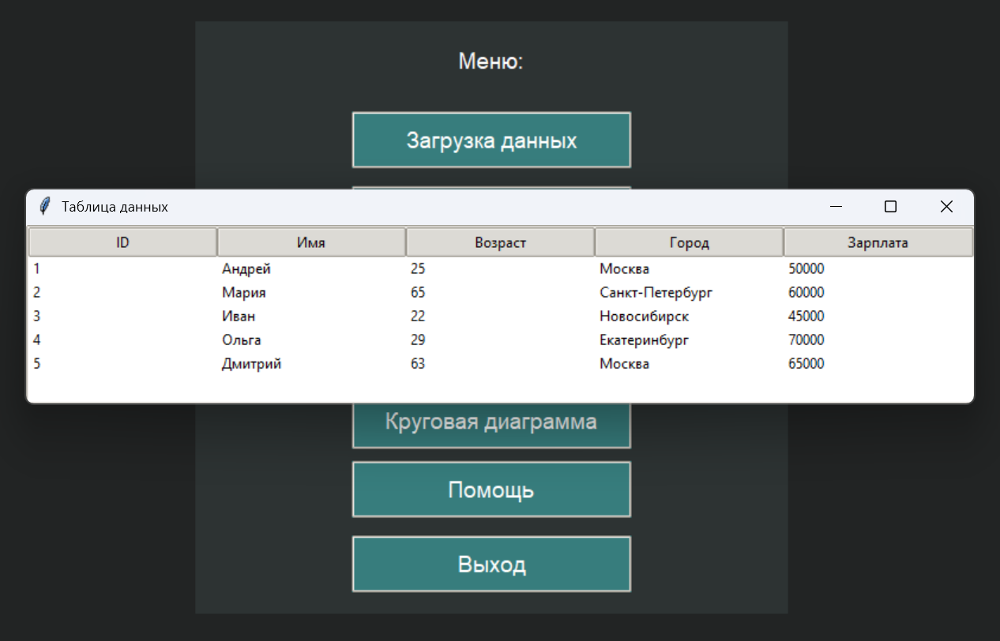
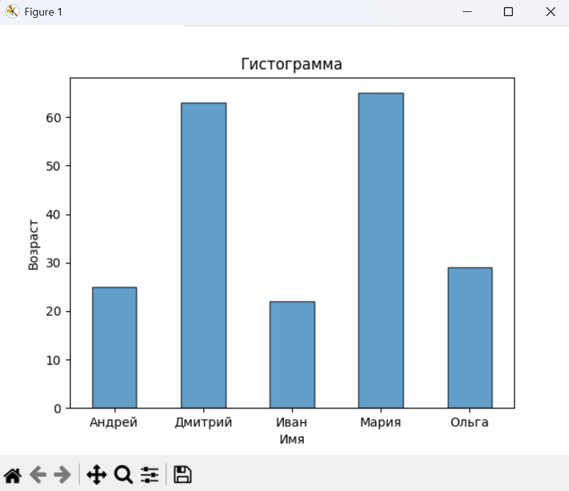
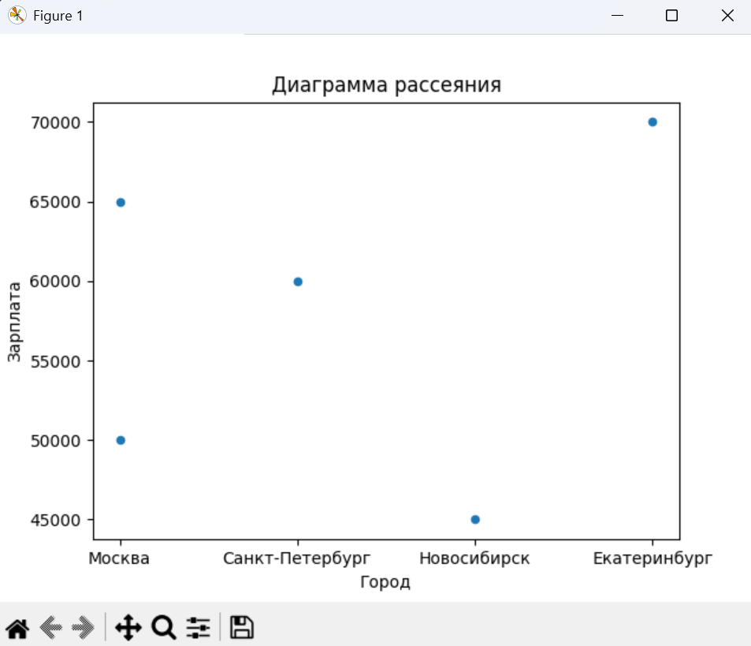
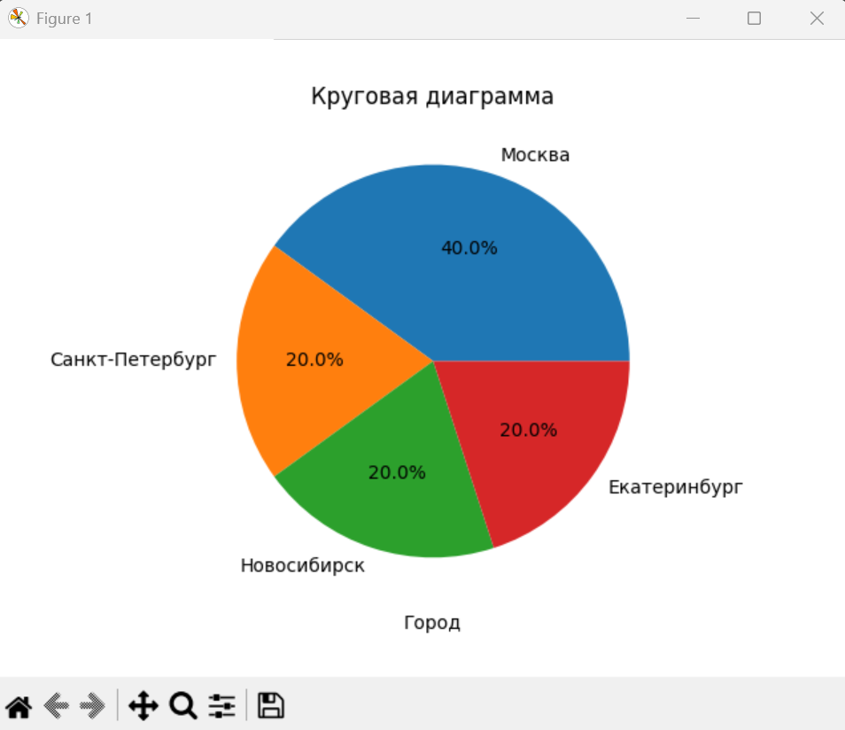
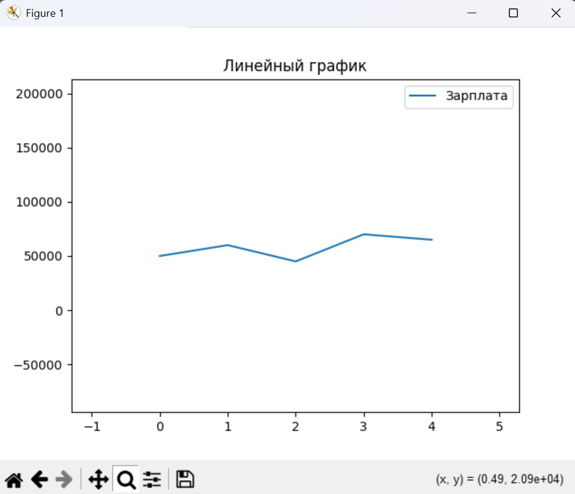
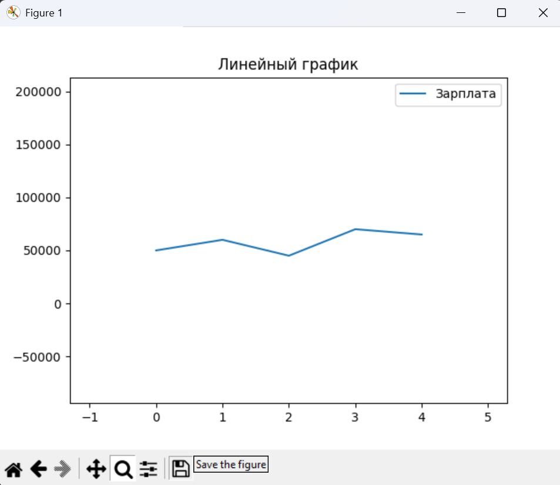
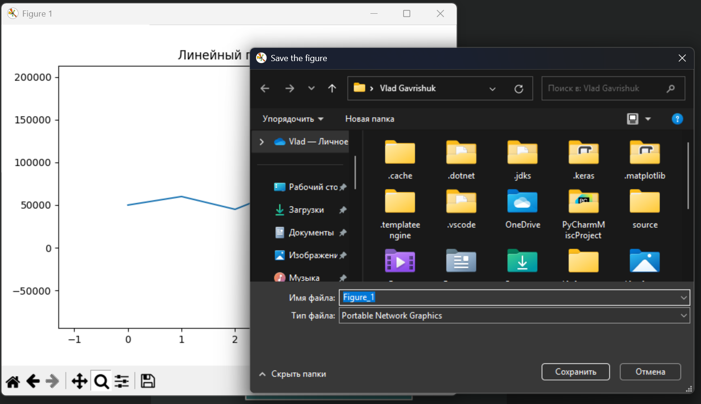
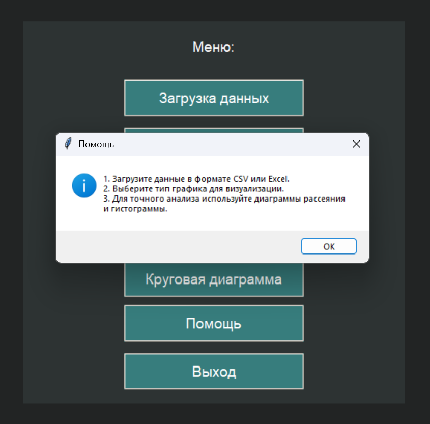

# Лабораторная работа 2

## Тема: "Интерактивный визуализатор данных"

## Цель работы

 Загрузка данных в табличном формате и отображение результатов в виде графиков и диаграмм для последующего анализа

## Основные требования

1. Интерфейс пользователя:
    - Возможность загрузки файлов данных (например, CSV, Excel).
    - Меню для выбора типов визуализации (линейные графики, гистограммы, диаграммы рассеяния и т.д.).
    - Интерактивные элементы управления (фильтры, ползунки, выпадающие списки и т.д.) для изменения параметров визуализации.
2. Обработка данных:
    - Импорт данных из загруженных файлов + визуализация данных в форме таблицы.
    - Обработка и очистка данных (например, устранение пропущенных значений, нормализация).
    - Возможность группировки и агрегирования данных.
3. Алгоритмы визуализации:
    - Реализация различных типов визуализаций (линейные графики, гистограммы, диаграммы рассеяния, круговые диаграммы и т.д.).
    - Возможность динамического обновления визуализаций при изменении параметров.
    - Интерактивные графики (увеличение, уменьшение, выделение отдельных элементов).
4. Функциональные возможности:
    - Возможность экспорта визуализаций в виде изображений (PNG, JPEG) или PDF.
    - Встроенные пояснения и подсказки для пользователей.

    
Оценка работы:
Для оценки работы в 4-5 баллов, нужно выполнить все Зеленые пункты.
Для оценки работы в 7-8 баллов, нужно дополнительно выполнить Бирюзовые пункты. Их всего 4, можно взять любые 3. 
Для оценки в 9-10 нужно выполнить Фиолетовые пункты. Их всего 2.
Итоговая оценка за работу складывается из числа выполненных требований к работе. Обязательными считаются зеленые, все остальные повышают итоговую оценку за работу. 

 

## Код программы

```
import tkinter as tk
from tkinter import filedialog, ttk, messagebox
import pandas as pd
import matplotlib.pyplot as plt

# Главный контейнер
root = tk.Tk()
root.title("Интерактивный визуализатор данных")
root.geometry("1920x1080")
root.configure(bg="#222424")

# Центрируем главный контейнер
root.columnconfigure(0, weight=1)
root.rowconfigure(0, weight=1)

# Настройка стиля
style = ttk.Style()
style.theme_use("clam")
style.configure("TLabel", background="#2d3333", foreground="white", font=("Arial", 14))
style.configure("Custom.TButton",
                background="#377d7d",
                foreground="white",
                font=("Arial", 14),
                padding=5)
style.map("Custom.TButton", background=[('active', '#FF8C69')])

# Создаем frame и увеличиваем его размеры
frame = tk.Frame(root, bg="#2d3333", width=500, height=500)
frame.grid(row=0, column=0)
frame.grid_propagate(False)
frame.columnconfigure(0, weight=1)

# Заголовок
title_label = ttk.Label(frame, text="Меню:")
title_label.grid(row=0, column=0, columnspan=2, pady=20)

df = None  # Глобальная переменная для хранения данных


# Функция загрузки данных
def load_data():
    global df
    file_path = filedialog.askopenfilename(filetypes=[("CSV Files", "*.csv"), ("Excel Files", "*.xlsx;*.xls")])
    if not file_path:
        return

    try:
        if file_path.endswith('.csv'):
            df = pd.read_csv(file_path)
        else:
            df = pd.read_excel(file_path)

        display_data(df)
    except Exception as e:
        messagebox.showerror("Ошибка", f"Не удалось загрузить файл: {e}")


# Функция отображения данных в новом окне
def display_data(df):
    data_window = tk.Toplevel(root)
    data_window.title("Таблица данных")
    data_window.geometry("800x600")

    tree = ttk.Treeview(data_window)
    tree.pack(expand=True, fill="both")

    tree["columns"] = list(df.columns)
    tree["show"] = "headings"

    for col in df.columns:
        tree.heading(col, text=col)
        tree.column(col, width=150)

    for _, row in df.iterrows():
        tree.insert("", "end", values=list(row))


# Функция выбора столбца
def select_columns(callback, single=False):
    if df is None:
        messagebox.showwarning("Предупреждение", "Сначала загрузите данные!")
        return

    def on_select():
        selected = listbox.curselection()
        columns = [listbox.get(i) for i in selected]
        top.destroy()
        if single:
            callback(columns[0])
        else:
            callback(columns)

    top = tk.Toplevel(root)
    top.title("Выбор столбцов")
    top.geometry("300x300")

    label = ttk.Label(top, text="Выберите столбцы:")
    label.pack(pady=5)

    listbox = tk.Listbox(top, selectmode=tk.SINGLE if single else tk.MULTIPLE)
    for col in df.columns:
        listbox.insert(tk.END, col)
    listbox.pack(expand=True, fill="both", pady=5)

    button = ttk.Button(top, text="Выбрать", command=on_select)
    button.pack(pady=5)


# Функции для визуализации данных
def plot_line_chart():
    def callback(columns):
        df[columns].plot(kind='line')
        plt.title("Линейный график")
        plt.show()

    select_columns(callback)


def plot_histogram():
    def callback(columns):
        if len(columns) != 2:
            messagebox.showwarning("Предупреждение",
                                   "Выберите два столбца: один категориальный и один числовой или два категориальных!")
            return

        category_col, value_col = columns

        if df[category_col].dtype == 'object' and df[value_col].dtype == 'object':
            grouped = df.groupby([category_col, value_col]).size().unstack().fillna(0)
            grouped.plot(kind='bar', stacked=True, alpha=0.7, edgecolor='black')
            plt.ylabel("Частота")
        else:
            df.groupby(category_col)[value_col].sum().plot(kind='bar', alpha=0.7, edgecolor='black')
            plt.ylabel(value_col)

        plt.title("Гистограмма")
        plt.xlabel(category_col)
        plt.xticks(rotation=360)
        plt.show()

    select_columns(callback)


def plot_scatter():
    def callback(columns):
        if len(columns) < 2:
            messagebox.showwarning("Предупреждение", "Выберите два столбца!")
            return
        df.plot(kind='scatter', x=columns[0], y=columns[1])
        plt.title("Диаграмма рассеяния")
        plt.show()

    select_columns(callback)


def plot_pie_chart():
    def callback(column):
        df[column].value_counts().plot(kind='pie', autopct='%1.1f%%')
        plt.title("Круговая диаграмма")
        plt.ylabel("")
        plt.show()

    select_columns(callback, single=True)


def show_help():
    messagebox.showinfo("Помощь",
                        "1. Загрузите данные в формате CSV или Excel.\n2. Выберите тип графика для визуализации.\n3. Для точного анализа используйте диаграммы рассеяния и гистограммы.")


# Кнопки меню
upload_button = ttk.Button(frame, text="Загрузка данных", style="Custom.TButton", width=20, command=load_data)
upload_button.grid(row=1, column=0, padx=5, pady=10, ipady=5)

line_plot_button = ttk.Button(frame, text="Линейный график", style="Custom.TButton", width=20, command=plot_line_chart)
line_plot_button.grid(row=2, column=0, padx=5, pady=5, ipady=5)

histogram_button = ttk.Button(frame, text="Гистограмма", style="Custom.TButton", width=20, command=plot_histogram)
histogram_button.grid(row=3, column=0, padx=5, pady=5, ipady=5)

scatter_plot_button = ttk.Button(frame, text="Диаграмма рассеяния", style="Custom.TButton", width=20,
                                 command=plot_scatter)
scatter_plot_button.grid(row=4, column=0, padx=5, pady=5, ipady=5)

pie_chart_button = ttk.Button(frame, text="Круговая диаграмма", style="Custom.TButton", width=20,
                              command=plot_pie_chart)
pie_chart_button.grid(row=5, column=0, padx=5, pady=5, ipady=5)

help_button = ttk.Button(frame, text="Помощь", style="Custom.TButton", width=20, command=show_help)
help_button.grid(row=6, column=0, padx=5, pady=5, ipady=5)

exit_button = ttk.Button(frame, text="Выход", style="Custom.TButton", width=20, command=root.quit)
exit_button.grid(row=7, column=0, padx=5, pady=10, ipady=5)

root.mainloop()

```
 
## Результаты работы

 
1. Интерфейс пользователя:
    - Возможность загрузки файлов данных (например, CSV, Excel).✅
   
    - Меню для выбора типов визуализации (линейные графики, гистограммы, диаграммы рассеяния и т.д.).✅
   
    - Интерактивные элементы управления (фильтры, ползунки, выпадающие списки и т.д.) для изменения параметров визуализации.✅
   
2. Обработка данных:
    - Импорт данных из загруженных файлов + визуализация данных в форме таблицы.✅
   
3. Алгоритмы визуализации:
    - Реализация различных типов визуализаций (линейные графики, гистограммы, диаграммы рассеяния, круговые диаграммы и т.д.).✅
   
   
   
   
    - Интерактивные графики (увеличение, уменьшение, выделение отдельных элементов).✅
   
4. Функциональные возможности:
    - Возможность экспорта визуализаций в виде изображений (PNG, JPEG) или PDF.✅
   
   
    - Встроенные пояснения и подсказки для пользователей.✅
   
 

