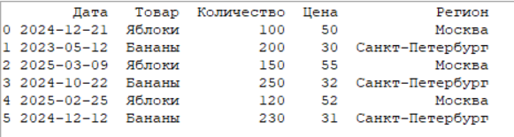
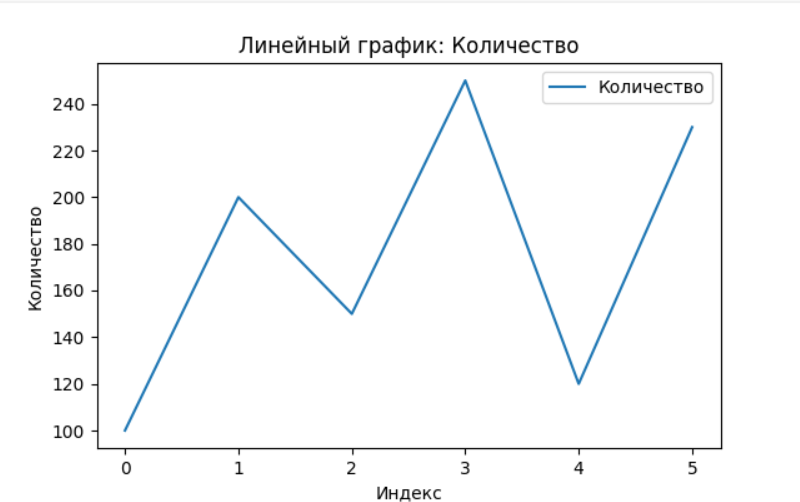
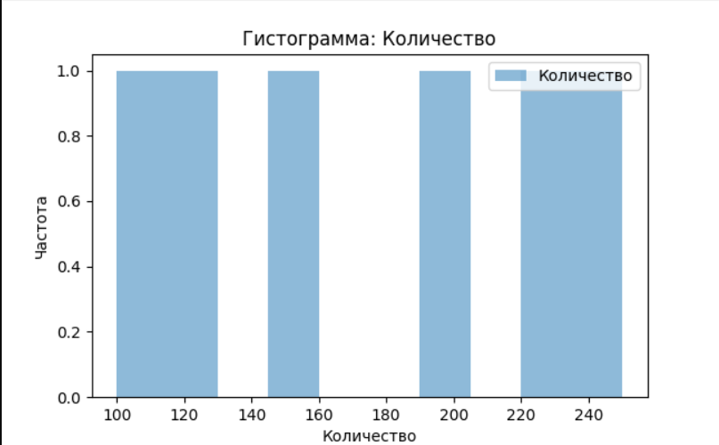
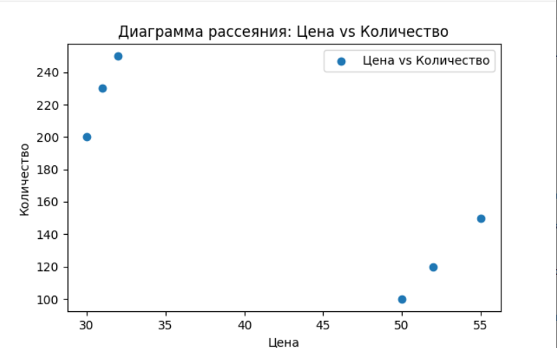
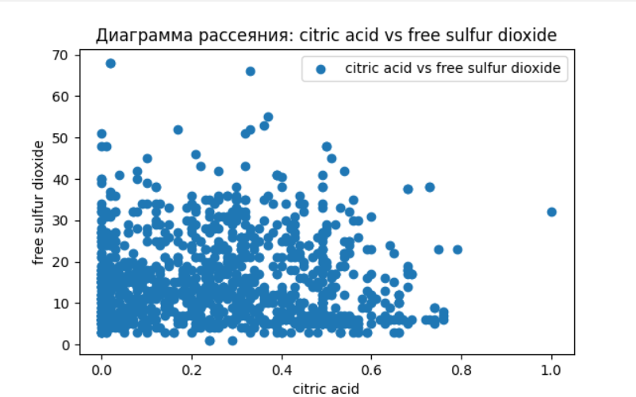
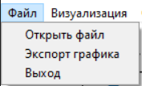
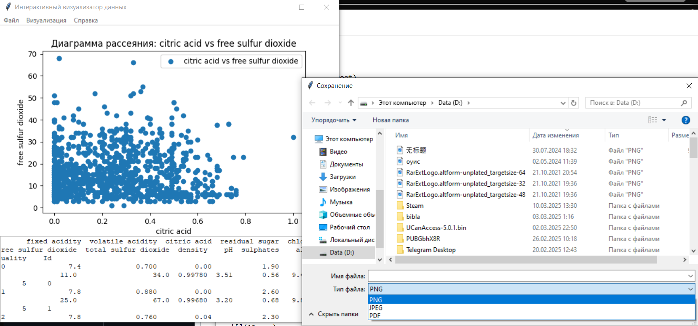
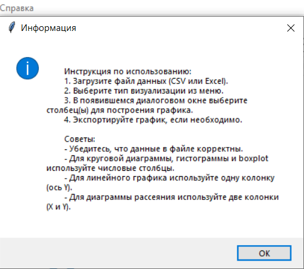

# Лабораторная работа 2

## Тема: "Интерактивный визуализатор данных"

Выполнил: Студент 3 курса, группы ИИ-23
Копач А. В.

Проверила Ситковец Я. С.

## Цель работы

 Загрузка данных в табличном формате и отображение результатов в виде графиков и диаграмм для последующего анализа

## Основные требования

1. Интерфейс пользователя:
    - Возможность загрузки файлов данных (например, CSV, Excel).
    - Меню для выбора типов визуализации (линейные графики, гистограммы, диаграммы рассеяния и т.д.).
    - Интерактивные элементы управления (фильтры, ползунки, выпадающие списки и т.д.) для изменения параметров визуализации.
2. Обработка данных:
    - Импорт данных из загруженных файлов + визуализация данных в форме таблицы.
    - Обработка и очистка данных (например, устранение пропущенных значений, нормализация).
    - Возможность группировки и агрегирования данных.
3. Алгоритмы визуализации:
    - Реализация различных типов визуализаций (линейные графики, гистограммы, диаграммы рассеяния, круговые диаграммы и т.д.).
    - Возможность динамического обновления визуализаций при изменении параметров.
    - Интерактивные графики (увеличение, уменьшение, выделение отдельных элементов).
4. Функциональные возможности:
    - Возможность экспорта визуализаций в виде изображений (PNG, JPEG) или PDF.
    - Встроенные пояснения и подсказки для пользователей.

    
Оценка работы:
Для оценки работы в 4-5 баллов, нужно выполнить все Зеленые пункты.
Для оценки работы в 7-8 баллов, нужно дополнительно выполнить Бирюзовые пункты. Их всего 4, можно взять любые 3. 
Для оценки в 9-10 нужно выполнить Фиолетовые пункты. Их всего 2.
Итоговая оценка за работу складывается из числа выполненных требований к работе. Обязательными считаются зеленые, все остальные повышают итоговую оценку за работу. 

 

## Код программы

```
import tkinter as tk
from tkinter import filedialog, messagebox, ttk
import pandas as pd
import matplotlib.pyplot as plt
from matplotlib.backends.backend_tkagg import FigureCanvasTkAgg


class DataVisualizerApp:
    def __init__(self, root):
        self.root = root
        self.root.title("Интерактивный визуализатор данных")

        self.data = None

        # Создание меню
        self.menu_bar = tk.Menu(root)
        self.file_menu = tk.Menu(self.menu_bar, tearoff=0)
        self.file_menu.add_command(label="Открыть файл", command=self.load_file)
        self.file_menu.add_command(label="Экспорт графика", command=self.export_plot)
        self.file_menu.add_command(label="Выход", command=root.quit)
        self.menu_bar.add_cascade(label="Файл", menu=self.file_menu)

        self.visualization_menu = tk.Menu(self.menu_bar, tearoff=0)
        self.visualization_menu.add_command(label="Линейный график", command=self.plot_line)
        self.visualization_menu.add_command(label="Гистограмма", command=self.plot_histogram)
        self.visualization_menu.add_command(label="Диаграмма рассеяния", command=self.plot_scatter)
        self.visualization_menu.add_command(label="Круговая диаграмма", command=self.plot_pie)
        self.visualization_menu.add_command(label="Boxplot", command=self.plot_boxplot)
        self.menu_bar.add_cascade(label="Визуализация", menu=self.visualization_menu)

        # Кнопка Info
        self.info_menu = tk.Menu(self.menu_bar, tearoff=0)
        self.info_menu.add_command(label="Info", command=self.show_info)
        self.menu_bar.add_cascade(label="Справка", menu=self.info_menu)

        self.root.config(menu=self.menu_bar)

        # Создание области для отображения графиков
        self.figure = plt.Figure(figsize=(5, 4), dpi=100)
        self.canvas = FigureCanvasTkAgg(self.figure, master=root)
        self.canvas.get_tk_widget().pack(side=tk.TOP, fill=tk.BOTH, expand=1)

        # Создание таблицы для отображения данных
        self.table = tk.Text(root, height=10)
        self.table.pack(side=tk.BOTTOM, fill=tk.BOTH, expand=1)

    def load_file(self):
        file_path = filedialog.askopenfilename(filetypes=[("CSV Files", "*.csv"), ("Excel Files", "*.xlsx")])
        if file_path:
            try:
                if file_path.endswith('.csv'):
                    self.data = pd.read_csv(file_path)
                elif file_path.endswith('.xlsx'):
                    self.data = pd.read_excel(file_path)
                self.show_data()
            except Exception as e:
                messagebox.showerror("Ошибка", f"Не удалось загрузить файл: {e}")

    def show_data(self):
        self.table.delete(1.0, tk.END)
        self.table.insert(tk.END, self.data.to_string())

    def select_column(self, title, message, numeric_only=False):
        """Диалоговое окно для выбора столбца из списка."""
        if self.data is not None:
            dialog = tk.Toplevel(self.root)
            dialog.title(title)
            dialog.geometry("300x100")

            label = ttk.Label(dialog, text=message)
            label.pack(pady=5)

            column_var = tk.StringVar()
            columns = self.data.columns.tolist()

            # Если нужны только числовые столбцы
            if numeric_only:
                numeric_columns = [col for col in columns if pd.api.types.is_numeric_dtype(self.data[col])]
                if not numeric_columns:
                    messagebox.showwarning("Ошибка", "Нет числовых столбцов для выбора.")
                    return None
                columns = numeric_columns

            combobox = ttk.Combobox(dialog, textvariable=column_var)
            combobox['values'] = columns
            combobox.pack(pady=5)

            selected_column = None

            def on_ok():
                nonlocal selected_column
                selected_column = column_var.get()
                dialog.destroy()

            ok_button = ttk.Button(dialog, text="OK", command=on_ok)
            ok_button.pack(pady=5)

            dialog.wait_window()  # Ждем закрытия окна
            return selected_column
        else:
            messagebox.showwarning("Ошибка", "Данные не загружены.")
            return None

    def select_two_columns(self, title, message):
        """Диалоговое окно для выбора двух столбцов из списка."""
        if self.data is not None:
            dialog = tk.Toplevel(self.root)
            dialog.title(title)
            dialog.geometry("300x150")

            label = ttk.Label(dialog, text=message)
            label.pack(pady=5)

            x_column_var = tk.StringVar()
            y_column_var = tk.StringVar()

            x_label = ttk.Label(dialog, text="Выберите столбец для оси X:")
            x_label.pack(pady=5)

            x_combobox = ttk.Combobox(dialog, textvariable=x_column_var)
            x_combobox['values'] = self.data.columns.tolist()
            x_combobox.pack(pady=5)

            y_label = ttk.Label(dialog, text="Выберите столбец для оси Y:")
            y_label.pack(pady=5)

            y_combobox = ttk.Combobox(dialog, textvariable=y_column_var)
            y_combobox['values'] = self.data.columns.tolist()
            y_combobox.pack(pady=5)

            selected_columns = (None, None)

            def on_ok():
                nonlocal selected_columns
                selected_columns = (x_column_var.get(), y_column_var.get())
                dialog.destroy()

            ok_button = ttk.Button(dialog, text="OK", command=on_ok)
            ok_button.pack(pady=5)

            dialog.wait_window()  # Ждем закрытия окна
            return selected_columns
        else:
            messagebox.showwarning("Ошибка", "Данные не загружены.")
            return None, None

    def plot_line(self):
        y_column = self.select_column("Линейный график", "Выберите столбец для оси Y")
        if y_column:
            self.figure.clear()
            ax = self.figure.add_subplot(111)
            ax.plot(self.data[y_column], label=y_column)
            ax.set_xlabel("Индекс")
            ax.set_ylabel(y_column)
            ax.set_title(f"Линейный график: {y_column}")
            ax.legend()
            self.canvas.draw()

    def plot_histogram(self):
        x_column = self.select_column("Гистограмма", "Выберите столбец для оси X", numeric_only=True)
        if x_column:
            self.figure.clear()
            ax = self.figure.add_subplot(111)
            ax.hist(self.data[x_column], bins=10, alpha=0.5, label=x_column)
            ax.set_xlabel(x_column)
            ax.set_ylabel("Частота")
            ax.set_title(f"Гистограмма: {x_column}")
            ax.legend()
            self.canvas.draw()

    def plot_scatter(self):
        x_column, y_column = self.select_two_columns("Диаграмма рассеяния", "Выберите столбцы для осей X и Y")
        if x_column and y_column:
            self.figure.clear()
            ax = self.figure.add_subplot(111)
            ax.scatter(self.data[x_column], self.data[y_column], label=f"{x_column} vs {y_column}")
            ax.set_xlabel(x_column)
            ax.set_ylabel(y_column)
            ax.set_title(f"Диаграмма рассеяния: {x_column} vs {y_column}")
            ax.legend()
            self.canvas.draw()

    def plot_pie(self):
        x_column = self.select_column("Круговая диаграмма", "Выберите числовой столбец для построения",
                                      numeric_only=True)
        if x_column:
            self.figure.clear()
            ax = self.figure.add_subplot(111)
            ax.pie(self.data[x_column], labels=self.data.index, autopct='%1.1f%%')
            ax.set_title(f"Круговая диаграмма: {x_column}")
            self.canvas.draw()

    def plot_boxplot(self):
        x_column = self.select_column("Boxplot", "Выберите столбец для построения", numeric_only=True)
        if x_column:
            self.figure.clear()
            ax = self.figure.add_subplot(111)
            ax.boxplot(self.data[x_column])
            ax.set_xlabel(x_column)
            ax.set_title(f"Boxplot: {x_column}")
            self.canvas.draw()

    def export_plot(self):
        if self.figure:
            file_path = filedialog.asksaveasfilename(defaultextension=".png",
                                                     filetypes=[("PNG", "*.png"), ("JPEG", "*.jpg"), ("PDF", "*.pdf")])
            if file_path:
                self.figure.savefig(file_path)
                messagebox.showinfo("Экспорт", f"График успешно экспортирован в {file_path}")

    def show_info(self):
        info_text = """
        Инструкция по использованию:
        1. Загрузите файл данных (CSV или Excel).
        2. Выберите тип визуализации из меню.
        3. В появившемся диалоговом окне выберите столбец(ы) для построения графика.
        4. Экспортируйте график, если необходимо.

        Советы:
        - Убедитесь, что данные в файле корректны.
        - Для круговой диаграммы, гистограммы и boxplot используйте числовые столбцы.
        - Для линейного графика используйте одну колонку (ось Y).
        - Для диаграммы рассеяния используйте две колонки (X и Y).
        """
        messagebox.showinfo("Информация", info_text)


if __name__ == "__main__":
    root = tk.Tk()
    app = DataVisualizerApp(root)
    root.mainloop()

```
 
## Результаты работы

 
1. Интерфейс пользователя:
    - Возможность загрузки файлов данных (например, CSV, Excel).✅
   
    - Меню для выбора типов визуализации (линейные графики, гистограммы, диаграммы рассеяния и т.д.).✅
   
2. Обработка данных:
    - Импорт данных из загруженных файлов + визуализация данных в форме таблицы.✅
   
3. Алгоритмы визуализации:
    - Реализация различных типов визуализаций (линейные графики, гистограммы, диаграммы рассеяния, круговые диаграммы и т.д.).✅
   
   
   
   
   
4. Функциональные возможности:
    - Возможность экспорта визуализаций в виде изображений (PNG, JPEG) или PDF.✅
   
   
    - Встроенные пояснения и подсказки для пользователей.✅
   
 

