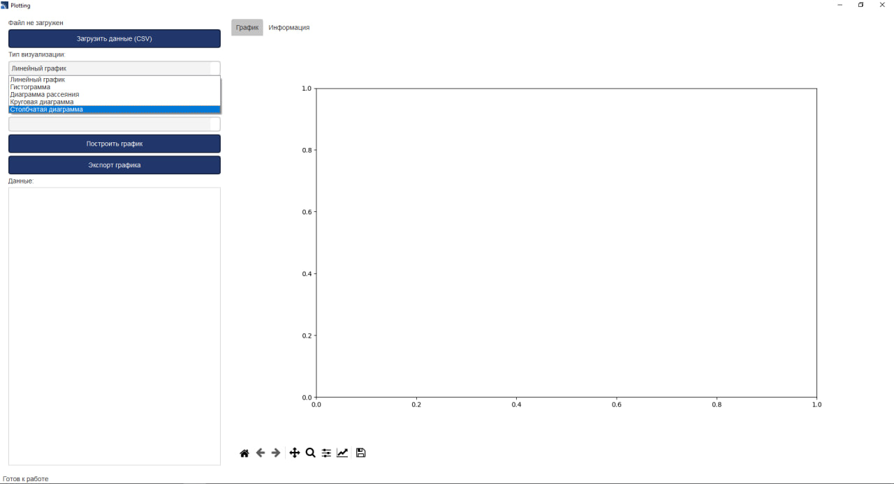
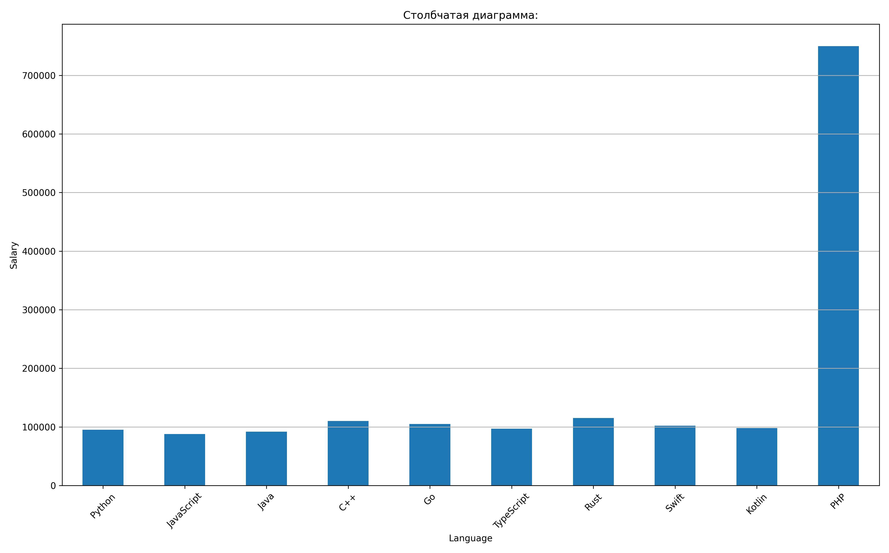

# Лабораторная работа 2

## Тема: "Интерактивный визуализатор данных"

## Цель работы

 Загрузка данных в табличном формате и отображение результатов в виде графиков и диаграмм для последующего анализа

## Основные требования

1. Интерфейс пользователя:
    - Возможность загрузки файлов данных (например, CSV, Excel).
    - Меню для выбора типов визуализации (линейные графики, гистограммы, диаграммы рассеяния и т.д.).
    - Интерактивные элементы управления (фильтры, ползунки, выпадающие списки и т.д.) для изменения параметров визуализации.
2. Обработка данных:
    - Импорт данных из загруженных файлов + визуализация данных в форме таблицы.
    - Обработка и очистка данных (например, устранение пропущенных значений, нормализация).
    - Возможность группировки и агрегирования данных.
3. Алгоритмы визуализации:
    - Реализация различных типов визуализаций (линейные графики, гистограммы, диаграммы рассеяния, круговые диаграммы и т.д.).
    - Возможность динамического обновления визуализаций при изменении параметров.
    - Интерактивные графики (увеличение, уменьшение, выделение отдельных элементов).
4. Функциональные возможности:
    - Возможность экспорта визуализаций в виде изображений (PNG, JPEG) или PDF.
    - Встроенные пояснения и подсказки для пользователей.

    
Оценка работы:
Для оценки работы в 4-5 баллов, нужно выполнить все Зеленые пункты.
Для оценки работы в 7-8 баллов, нужно дополнительно выполнить Бирюзовые пункты. Их всего 4, можно взять любые 3. 
Для оценки в 9-10 нужно выполнить Фиолетовые пункты. Их всего 2.
Итоговая оценка за работу складывается из числа выполненных требований к работе. Обязательными считаются зеленые, все остальные повышают итоговую оценку за работу. 

 

## Код программы

```
import sys
import pandas as pd
import matplotlib.pyplot as plt
from matplotlib.backends.backend_qt5agg import FigureCanvasQTAgg as FigureCanvas
from matplotlib.backends.backend_qt5agg import NavigationToolbar2QT as NavigationToolbar
from PyQt5.QtWidgets import (QApplication, QMainWindow, QVBoxLayout, QHBoxLayout, QWidget, QLabel,
                             QPushButton, QFileDialog, QComboBox, QTableWidget, QTableWidgetItem,
                             QMessageBox, QTabWidget, QSizePolicy, QSplitter, QScrollArea)
from PyQt5.QtCore import Qt
from PyQt5.QtGui import QIcon


class DataVisualizer(QMainWindow):
    def __init__(self):
        super().__init__()
        self.setWindowTitle("Plotting")
        self.setGeometry(100, 100, 1200, 800)
        self.setWindowIcon(QIcon('icon.png'))

        self.data = None
        self.current_plot = None

        self.init_ui()
        self.show()

    def init_ui(self):
        main_widget = QWidget()
        main_layout = QHBoxLayout()
        main_widget.setLayout(main_layout)
        self.setCentralWidget(main_widget)

        self.setStyleSheet("""
            QWidget {
                background-color: #ffffff;
                font-family: 'Arial', sans-serif;
                font-size: 14px;
                color: #333333;
            }
        """)

        splitter = QSplitter(Qt.Horizontal)
        main_layout.addWidget(splitter)

        left_panel = QWidget()
        left_layout = QVBoxLayout()
        left_panel.setLayout(left_layout)
        splitter.addWidget(left_panel)

        right_panel = QWidget()
        right_layout = QVBoxLayout()
        right_panel.setLayout(right_layout)
        splitter.addWidget(right_panel)

        splitter.setSizes([300, 900])

        self.file_label = QLabel("Файл не загружен")
        left_layout.addWidget(self.file_label)

        load_button = QPushButton("Загрузить данные (CSV)")
        load_button.clicked.connect(self.load_data)
        left_layout.addWidget(load_button)

        left_layout.addWidget(QLabel("Тип визуализации:"))
        self.plot_type = QComboBox()
        self.plot_type.addItems(["Линейный график", "Гистограмма", "Диаграмма рассеяния",
                                 "Круговая диаграмма", "Столбчатая диаграмма"])
        left_layout.addWidget(self.plot_type)

        left_layout.addWidget(QLabel("Ось X:"))
        self.x_axis = QComboBox()
        left_layout.addWidget(self.x_axis)

        left_layout.addWidget(QLabel("Ось Y:"))
        self.y_axis = QComboBox()
        left_layout.addWidget(self.y_axis)

        plot_button = QPushButton("Построить график")
        plot_button.clicked.connect(self.plot_data)
        left_layout.addWidget(plot_button)

        export_button = QPushButton("Экспорт графика")
        export_button.clicked.connect(self.export_plot)
        left_layout.addWidget(export_button)

        left_layout.addWidget(QLabel("Данные:"))
        self.table = QTableWidget()
        self.table.setSizePolicy(QSizePolicy.Expanding, QSizePolicy.Expanding)
        left_layout.addWidget(self.table)

        self.tabs = QTabWidget()
        right_layout.addWidget(self.tabs)

        self.plot_tab = QWidget()
        self.plot_layout = QVBoxLayout()
        self.plot_tab.setLayout(self.plot_layout)
        self.tabs.addTab(self.plot_tab, "График")

        self.info_tab = QWidget()
        info_layout = QVBoxLayout()
        self.info_tab.setLayout(info_layout)

        scroll = QScrollArea()
        scroll.setWidgetResizable(True)

        info_widget = QWidget()
        info_scroll_layout = QVBoxLayout(info_widget)

        info_text = QLabel("""<h1 style="font-size: 16pt; margin-bottom: 15px;">Приложение для построения графиков</h1>
                <p style="font-size: 12pt; margin-bottom: 10px;"><b>Инструкция по использованию:</b></p>
                <ol style="font-size: 11pt; line-height: 1.5; margin-left: 20px;">
                    <li>Нажмите "Загрузить данные" и выберите CSV файл</li>
                    <li>Данные отобразятся в таблице слева</li>
                    <li>Выберите тип визуализации</li>
                    <li>Выберите столбцы для осей X и Y (если применимо)</li>
                    <li>Нажмите "Построить график"</li>
                    <li>Для экспорта графика нажмите "Экспорт графика"</li>
                </ol>
                <p style="font-size: 12pt; margin-top: 15px; margin-bottom: 10px;"><b>Подсказки:</b></p>
                <ul style="font-size: 11pt; line-height: 1.5; margin-left: 20px;">
                    <li>Линейные графики подходят для временных рядов</li>
                    <li>Гистограммы показывают распределение данных</li>
                    <li>Диаграммы рассеяния полезны для корреляционного анализа</li>
                    <li>Круговые диаграммы показывают доли целого</li>
                    <li>Столбчатые диаграммы удобны для сравнения категорий по значениям</li>
                </ul>
                <p style="font-size: 11pt; line-height: 1;"><b>Важно:</b> файл с данными должен быть корректно оформлен — первая строка заголовки, далее данные. 
                Для некоторых графиков (например, круговой) нужно выбирать категориальные и числовые столбцы соответственно.</p>
                """)
        info_text.setWordWrap(True)
        info_text.setAlignment(Qt.AlignTop)
        info_scroll_layout.addWidget(info_text)
        info_scroll_layout.addStretch()

        scroll.setWidget(info_widget)
        info_layout.addWidget(scroll)

        self.tabs.addTab(self.info_tab, "Информация")

        self.figure, self.ax = plt.subplots()
        self.canvas = FigureCanvas(self.figure)
        self.plot_layout.addWidget(self.canvas)

        self.toolbar = NavigationToolbar(self.canvas, self)
        self.plot_layout.addWidget(self.toolbar)

        self.statusBar().showMessage("Готов к работе")

        # Применяем стиль CSS
        self.set_combobox_style()
        self.set_button_style()
        self.set_table_style()
        self.set_plot_and_info_style()

    def set_plot_and_info_style(self):
        # Стили для вкладки информации
        self.info_tab.setStyleSheet("""
            QWidget {
                background-color: #ffffff;
                border: none;
            }
        """)

        # Стили для скролла
        scroll_style = """
            QScrollArea {
                background-color: #ffffff;
                border: none;
            }
            QLabel {
                background-color: #ffffff;
                border: none;
                padding: 15px;
            }
        """
        self.info_tab.findChild(QScrollArea).setStyleSheet(scroll_style)

        # Стили для вкладок
        self.tabs.setStyleSheet("""
            QTabWidget::pane {
                border: none;
                border-radius: 0px;
            }
            QTabBar::tab {
                background: #ffffff;
                padding: 10px;
                margin-right: 2px;
                border-top-left-radius: 4px;
                border-top-right-radius: 4px;
            }
            QTabBar::tab:selected {
                background: #c3c3c3;
            }
        """)

    def set_combobox_style(self):
        style = """
        QComboBox {
            background-color: #f4f4f4;
            border: 2px solid #cccccc;
            border-radius: 5px;
            padding: 5px;
            font-size: 14px;
            font-family: 'Arial', sans-serif;
            color: #333333;
        }
        QComboBox::drop-down {
            background-color: #ffffff;
            border: none;
            border-radius: 5px;
            width: 20px;
        }
        QComboBox::down-arrow {
            image: url('path/to/arrow-icon.png');
            width: 16px;
            height: 16px;
        }
        QComboBox QAbstractItemView::item:hover {
            background-color: #0078d4;
            color: #ffffff;
        }
        QComboBox::item:selected {
            background-color: #0078d4;
            color: #ffffff;
        }
        """
        self.plot_type.setStyleSheet(style)
        self.x_axis.setStyleSheet(style)
        self.y_axis.setStyleSheet(style)

    def set_button_style(self):
        button_style = """
        QPushButton {
            background-color: #21366a;
            color: white;
            border-radius: 5px;
            padding: 10px;
            font-size: 14px;
            font-family: 'Arial', sans-serif;
            border: 2px solid #18233d;
        }
        QPushButton:hover {
            background-color: #18233d;
        }
        QPushButton:pressed {
            background-color: #004c8c;
        }
        """
        for button in self.findChildren(QPushButton):
            button.setStyleSheet(button_style)

    def set_table_style(self):
        table_style = """
        QTableWidget {
            background-color: white;
            font-size: 12px;
            font-family: 'Arial', sans-serif;
            color: black;
            border: 1px solid #cccccc;
        }
        QTableWidget::item {
            padding: 5px;
            background-color: white;
            color: black;
        }
        QTableWidget::item:selected {
            background-color: #0078d4;
            color: white;
        }
        QTableWidget::horizontalHeader {
            background-color: white;
            color: black;
            font-weight: bold;
            border: none;
        }
        QTableWidget::verticalHeader {
            background-color: white;
            color: black;
            border: none;
        }
        QTableCornerButton::section {
            background-color: white;
            border: none;
        }
        """
        self.table.setStyleSheet(table_style)

    def load_data(self):
        file_name, _ = QFileDialog.getOpenFileName(self, "Открыть CSV файл", "",
                                                   "CSV Files (*.csv);;All Files (*)")

        if not file_name:
            return

        try:
            self.data = pd.read_csv(file_name, sep=None, engine='python', encoding_errors='ignore')

            if self.data.empty:
                raise ValueError("Файл не содержит данных")

            self.file_label.setText(f"Файл: {file_name.split('/')[-1]}")
            self.update_table()
            self.update_axis_selectors()
            self.statusBar().showMessage(f"Данные загружены: {len(self.data)} строк, {len(self.data.columns)} столбцов")

        except Exception as e:
            QMessageBox.critical(self, "Ошибка", f"Не удалось загрузить файл:\n{str(e)}")

    def update_table(self):
        if self.data is None:
            return

        self.table.setRowCount(self.data.shape[0])
        self.table.setColumnCount(self.data.shape[1])
        self.table.setHorizontalHeaderLabels(self.data.columns)

        for i in range(self.data.shape[0]):
            for j in range(self.data.shape[1]):
                item = QTableWidgetItem(str(self.data.iloc[i, j]))
                item.setFlags(item.flags() ^ Qt.ItemIsEditable)
                self.table.setItem(i, j, item)

    def update_axis_selectors(self):
        if self.data is None:
            return

        columns = self.data.columns.tolist()

        self.x_axis.clear()
        self.x_axis.addItems(columns)

        self.y_axis.clear()
        self.y_axis.addItems(columns)
        self.y_axis.setCurrentIndex(1 if len(columns) > 1 else 0)

    def plot_data(self):
        if self.data is None:
            QMessageBox.warning(self, "Ошибка", "Сначала загрузите данные")
            return

        plot_type = self.plot_type.currentText()
        x_col = self.x_axis.currentText()
        y_col = self.y_axis.currentText()

        try:
            self.figure.clf()
            self.ax = self.figure.add_subplot(111)

            if plot_type == "Линейный график":
                self.ax.plot(self.data[x_col], self.data[y_col], marker='o', linestyle='-')
                self.ax.set_xlabel(x_col)
                self.ax.set_ylabel(y_col)
                self.ax.set_title(f"Линейный график:")
                self.ax.grid(True)

            elif plot_type == "Гистограмма":
                self.ax.hist(self.data[x_col], bins=10, edgecolor='black')
                self.ax.set_xlabel(x_col)
                self.ax.set_ylabel("Частота")
                self.ax.set_title(f"Гистограмма:")
                self.ax.grid(True, linestyle='--', alpha=0.5)

            elif plot_type == "Диаграмма рассеяния":
                self.ax.scatter(self.data[x_col], self.data[y_col])
                self.ax.set_xlabel(x_col)
                self.ax.set_ylabel(y_col)
                self.ax.set_title(f"Диаграмма рассеяния:")
                self.ax.grid(True)

            elif plot_type == "Круговая диаграмма":
                try:
                    sizes = pd.to_numeric(self.data[y_col])
                    labels = self.data[x_col]

                    mask = sizes > 0
                    sizes = sizes[mask]
                    labels = labels[mask]

                    if len(sizes) < 1:
                        raise ValueError("Нет данных для отображения")

                    threshold = sizes.sum() * 0.05
                    if (sizes < threshold).any():
                        mask = sizes >= threshold
                        other_sum = sizes[~mask].sum()
                        sizes = pd.concat([sizes[mask], pd.Series([other_sum], index=['Другие'])])
                        labels = pd.concat([labels[mask], pd.Series(['Другие'], index=[len(labels)])])

                    wedges, texts, autotexts = self.ax.pie(
                        sizes, labels=labels, autopct='%1.1f%%',
                        startangle=90, counterclock=False,
                        textprops={'fontsize': 8}
                    )

                    for autotext in autotexts:
                        autotext.set_color('white')

                    self.ax.set_title("Круговая диаграмма")
                    self.ax.axis('equal')

                except Exception as e:
                    QMessageBox.critical(self, "Ошибка данных",
                                         f"Ошибка обработки данных для круговой диаграммы:\n{str(e)}")
                    return

            elif plot_type == "Столбчатая диаграмма":
                self.data.plot.bar(x=x_col, y=y_col, ax=self.ax, legend=False)
                self.ax.set_xlabel(x_col)
                self.ax.set_ylabel(y_col)
                self.ax.set_title(f"Столбчатая диаграмма:")
                plt.xticks(rotation=45)
                self.ax.grid(True, axis='y')

            self.figure.tight_layout()
            self.canvas.draw()
            self.statusBar().showMessage(f"Построен график: {plot_type}")

        except Exception as e:
            QMessageBox.critical(self, "Ошибка построения",
                                 f"Не удалось построить график:\n{str(e)}")

    def export_plot(self):
        if self.data is None or self.ax.lines == [] and len(self.ax.patches) == 0 and len(self.ax.images) == 0:
            QMessageBox.warning(self, "Ошибка", "Нет графика для экспорта")
            return

        file_name, _ = QFileDialog.getSaveFileName(self, "Экспорт графика", "",
                                                   "PNG (*.png);;JPEG (*.jpg *.jpeg);;PDF (*.pdf);;All Files (*)")

        if not file_name:
            return

        try:
            if file_name.endswith('.png'):
                self.figure.savefig(file_name, dpi=300)
            elif file_name.endswith('.jpg') or file_name.endswith('.jpeg'):
                self.figure.savefig(file_name, dpi=300, quality=95)
            elif file_name.endswith('.pdf'):
                self.figure.savefig(file_name, format='pdf')

            QMessageBox.information(self, "Экспорт", f"График успешно экспортирован в файл:\n{file_name}")
            self.statusBar().showMessage(f"График экспортирован: {file_name}")

        except Exception as e:
            QMessageBox.critical(self, "Ошибка экспорта", f"Не удалось экспортировать файл:\n{str(e)}")


if __name__ == "__main__":
    app = QApplication(sys.argv)
    ex = DataVisualizer()
    sys.exit(app.exec_())
```
 
## Результаты работы

Интерфейс
   
1. Интерфейс пользователя:
    - Возможность загрузки файлов данных (например, CSV).✅
    - Меню для выбора типов визуализации (линейные графики, гистограммы, диаграммы рассеяния и т.д.).✅
    - Интерактивные элементы управления (фильтры, ползунки, выпадающие списки и т.д.) для изменения параметров визуализации.✅
   
2. Обработка данных:
    - Импорт данных из загруженных файлов + визуализация данных в форме таблицы.✅
    - Обработка и очистка данных (например, устранение пропущенных значений, нормализация).✅
    - Возможность группировки и агрегирования данных.✅
   
3. Алгоритмы визуализации:
    - Реализация различных типов визуализаций (линейные графики, гистограммы, диаграммы рассеяния, круговые диаграммы и т.д.).✅
   
   
   
   
   
    - Возможность динамического обновления визуализаций при изменении параметров.✅
    - Интерактивные графики.✅
   
4. Функциональные возможности:
    - Возможность экспорта визуализаций в виде изображений (PNG, JPEG) или PDF.✅
   
    - Встроенные пояснения и подсказки для пользователей.✅
   
 

