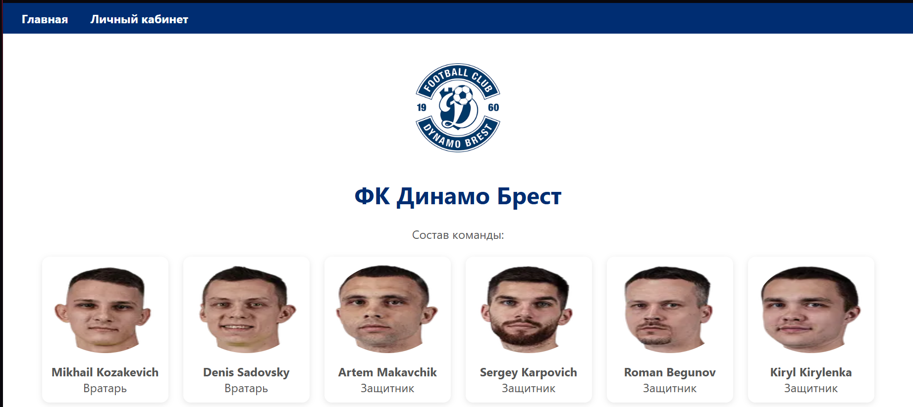
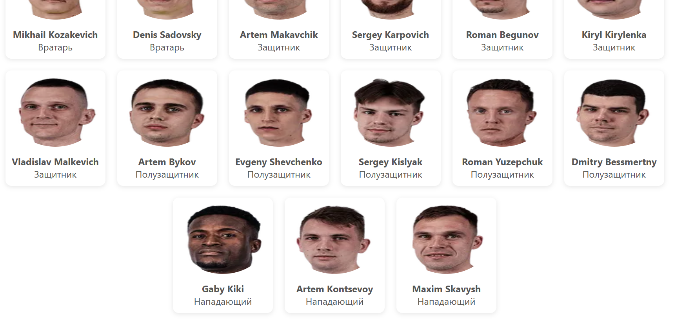
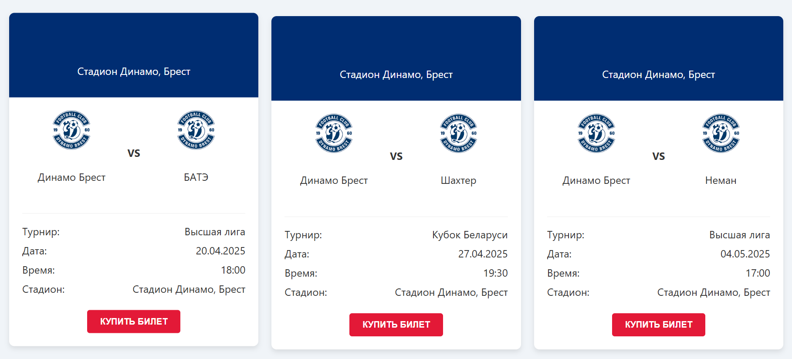
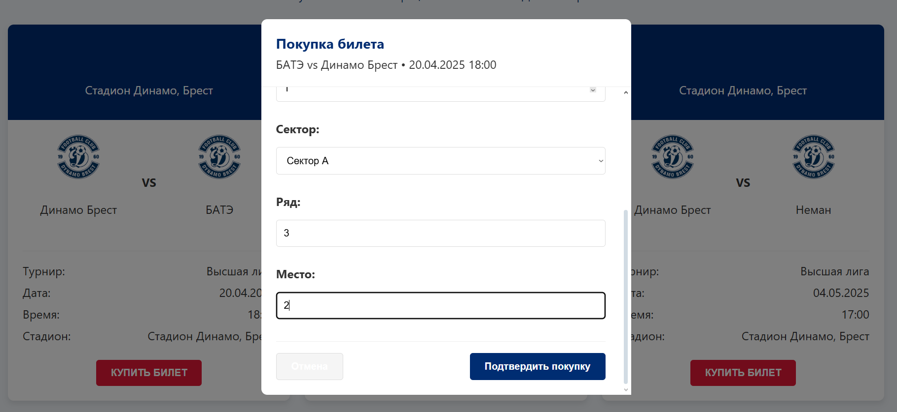
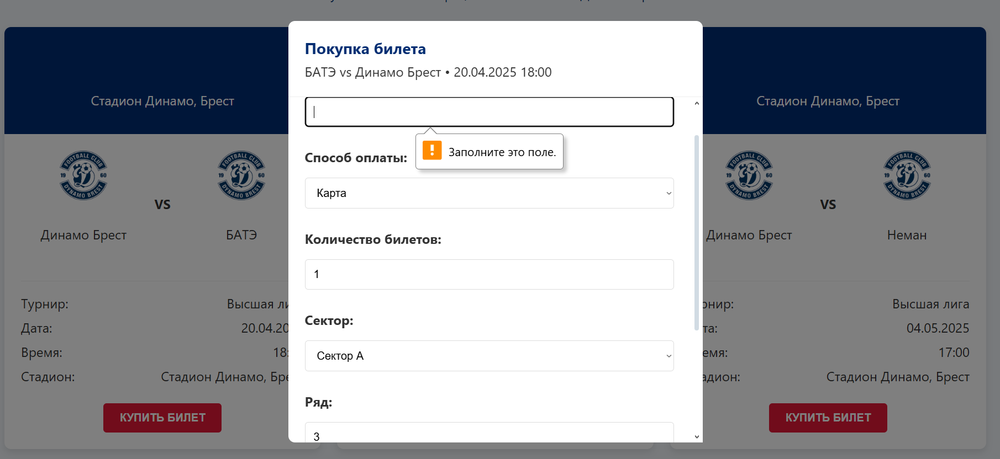
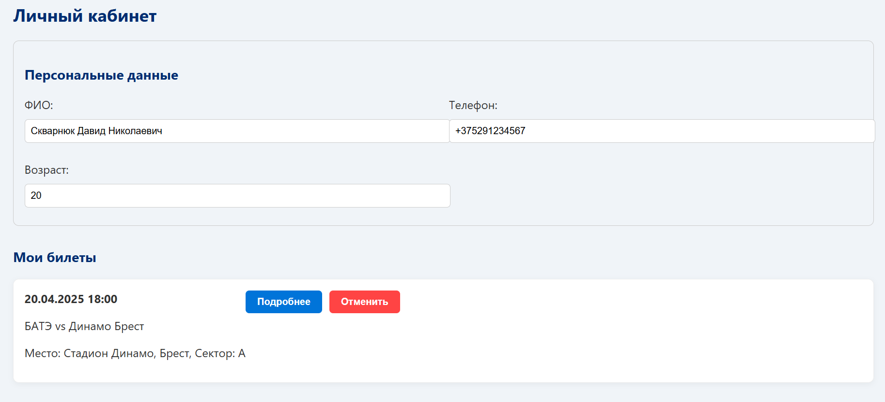
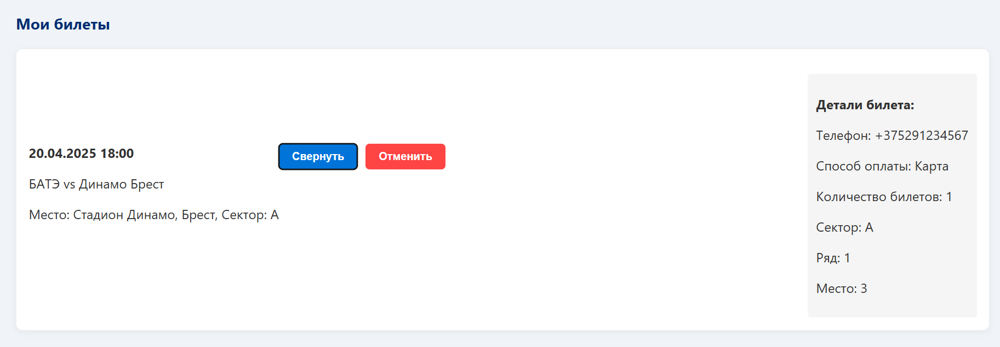
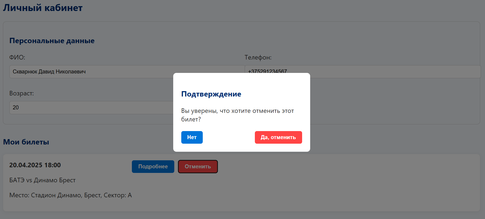

# Лабораторная работа 3

## Тема: "Создание высокоуровневого макета сайта"

**Выполнил:**
Студент 3 курса, группы ИИ-23  
Скварнюк Д.Н.

**Проверила:**
Ситковец Я.С.

10 вариант

## Цель работы

 Cайт представляет собой макет высокого уровня без функциональной части. Реализовать возможность демонстрации работы сайта, заполняя поля необходимой информацией и демонстрируя переходы между страницами сайта.

##Задача

Сайт спортивной команды

## Требования

Основные страницы:   
• Главная страница: Информация о команде, расписание матчей.  
• Детальная страница матча: Описание события, участники, место проведения.  
• Покупка билетов: Форма для ввода данных покупателя и выбора количества билетов.  
• Подтверждение заказа: Страница с информацией о покупке билетов, возможностью отмены.  

## Код программы

```
import React, { useState } from "react";

const MatchModal = ({ match, onClose, onConfirm }) => {
    const [formData, setFormData] = useState({
        phone: "",
        payment: "Карта",
        count: 1,
        sector: "A",
        row: "",
        seat: ""
    });

    const handleChange = (e) => {
        const { name, value } = e.target;
        setFormData(prev => ({ ...prev, [name]: value }));
    };

    const handleSubmit = (e) => {
        e.preventDefault();
        onConfirm({
            ...match,
            ...formData
        });
    };

    return (
        <div style={{
            position: 'fixed',
            top: 0,
            left: 0,
            right: 0,
            bottom: 0,
            backgroundColor: 'rgba(0,0,0,0.5)',
            display: 'flex',
            justifyContent: 'center',
            alignItems: 'center',
            zIndex: 1000
        }}>
            <div style={{
                backgroundColor: 'white',
                borderRadius: '8px',
                width: '90%',
                maxWidth: '500px',
                maxHeight: '90vh',
                display: 'flex',
                flexDirection: 'column'
            }}>
                <div style={{
                    padding: '20px',
                    borderBottom: '1px solid #eee',
                    position: 'relative'
                }}>
                    <h3 style={{ margin: 0 }}>Покупка билета</h3>
                    <p style={{ margin: '5px 0 0' }}>
                        {match.team} vs Динамо Брест • {match.date} {match.time}
                    </p>
                    <button
                        onClick={onClose}
                        style={{
                            position: 'absolute',
                            top: '10px',
                            right: '10px',
                            background: 'none',
                            border: 'none',
                            fontSize: '20px',
                            cursor: 'pointer'
                        }}
                    >
                        ×
                    </button>
                </div>

                <div style={{
                    padding: '20px',
                    overflowY: 'auto',
                    flex: 1
                }}>
                    <form onSubmit={handleSubmit}>
                        <div style={{ marginBottom: '15px' }}>
                            <label style={{
                                display: 'block',
                                marginBottom: '5px',
                                fontWeight: 'bold'
                            }}>
                                Телефон:
                            </label>
                            <input
                                type="tel"
                                name="phone"
                                value={formData.phone}
                                onChange={handleChange}
                                required
                                style={{
                                    width: '100%',
                                    padding: '10px',
                                    border: '1px solid #ddd',
                                    borderRadius: '4px',
                                    boxSizing: 'border-box'
                                }}
                            />
                        </div>

                        <div style={{ marginBottom: '15px' }}>
                            <label style={{
                                display: 'block',
                                marginBottom: '5px',
                                fontWeight: 'bold'
                            }}>
                                Способ оплаты:
                            </label>
                            <select
                                name="payment"
                                value={formData.payment}
                                onChange={handleChange}
                                style={{
                                    width: '100%',
                                    padding: '10px',
                                    border: '1px solid #ddd',
                                    borderRadius: '4px',
                                    boxSizing: 'border-box'
                                }}
                            >
                                <option value="Карта">Карта</option>
                                <option value="Наличные">Наличные</option>
                                <option value="PayPal">PayPal</option>
                            </select>
                        </div>

                        <div style={{ marginBottom: '15px' }}>
                            <label style={{
                                display: 'block',
                                marginBottom: '5px',
                                fontWeight: 'bold'
                            }}>
                                Количество билетов:
                            </label>
                            <input
                                type="number"
                                name="count"
                                min="1"
                                value={formData.count}
                                onChange={handleChange}
                                required
                                style={{
                                    width: '100%',
                                    padding: '10px',
                                    border: '1px solid #ddd',
                                    borderRadius: '4px',
                                    boxSizing: 'border-box'
                                }}
                            />
                        </div>

                        <div style={{ marginBottom: '15px' }}>
                            <label style={{
                                display: 'block',
                                marginBottom: '5px',
                                fontWeight: 'bold'
                            }}>
                                Сектор:
                            </label>
                            <select
                                name="sector"
                                value={formData.sector}
                                onChange={handleChange}
                                style={{
                                    width: '100%',
                                    padding: '10px',
                                    border: '1px solid #ddd',
                                    borderRadius: '4px',
                                    boxSizing: 'border-box'
                                }}
                            >
                                <option value="A">Сектор A</option>
                                <option value="B">Сектор B</option>
                                <option value="C">Сектор C</option>
                            </select>
                        </div>

                        <div style={{ marginBottom: '15px' }}>
                            <label style={{
                                display: 'block',
                                marginBottom: '5px',
                                fontWeight: 'bold'
                            }}>
                                Ряд:
                            </label>
                            <input
                                type="text"
                                name="row"
                                value={formData.row}
                                onChange={handleChange}
                                style={{
                                    width: '100%',
                                    padding: '10px',
                                    border: '1px solid #ddd',
                                    borderRadius: '4px',
                                    boxSizing: 'border-box'
                                }}
                            />
                        </div>

                        <div style={{ marginBottom: '20px' }}>
                            <label style={{
                                display: 'block',
                                marginBottom: '5px',
                                fontWeight: 'bold'
                            }}>
                                Место:
                            </label>
                            <input
                                type="text"
                                name="seat"
                                value={formData.seat}
                                onChange={handleChange}
                                style={{
                                    width: '100%',
                                    padding: '10px',
                                    border: '1px solid #ddd',
                                    borderRadius: '4px',
                                    boxSizing: 'border-box'
                                }}
                            />
                        </div>

                        <div style={{
                            display: 'flex',
                            justifyContent: 'space-between',
                            paddingTop: '15px',
                            borderTop: '1px solid #eee'
                        }}>
                            <button
                                type="button"
                                onClick={onClose}
                                style={{
                                    padding: '10px 20px',
                                    backgroundColor: '#f5f5f5',
                                    border: '1px solid #ddd',
                                    borderRadius: '4px',
                                    cursor: 'pointer'
                                }}
                            >
                                Отмена
                            </button>
                            <button
                                type="submit"
                                style={{
                                    padding: '10px 20px',
                                    backgroundColor: '#002d72',
                                    color: 'white',
                                    border: 'none',
                                    borderRadius: '4px',
                                    cursor: 'pointer'
                                }}
                            >
                                Подтвердить покупку
                            </button>
                        </div>
                    </form>
                </div>
            </div>
        </div>
    );
};

export default MatchModal;

```
 
## Результаты работы

Интерфейс
 
 
 
 
 
 
 
 