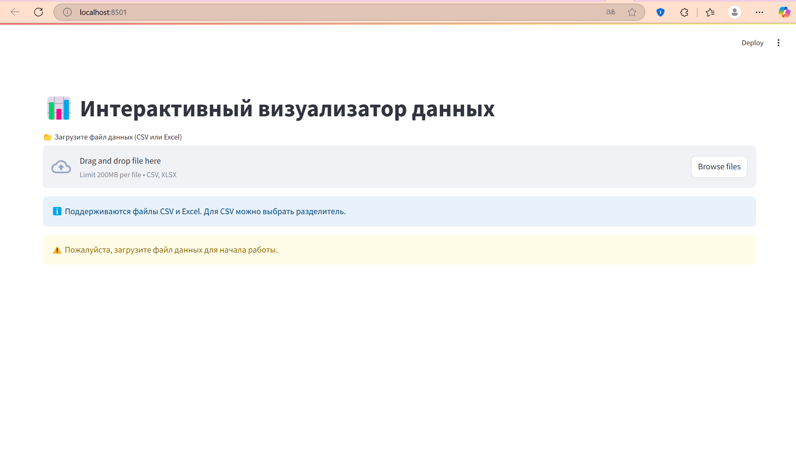
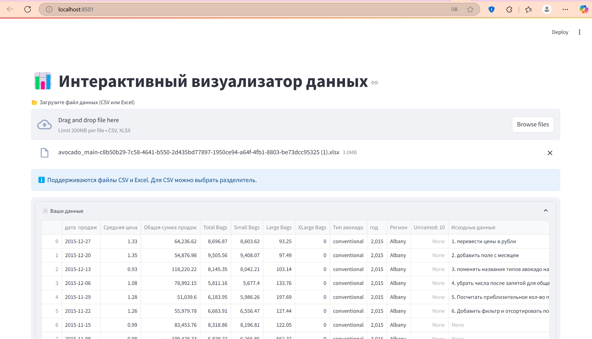
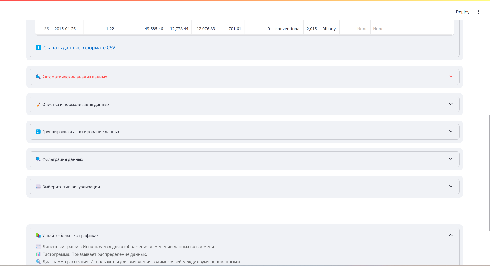
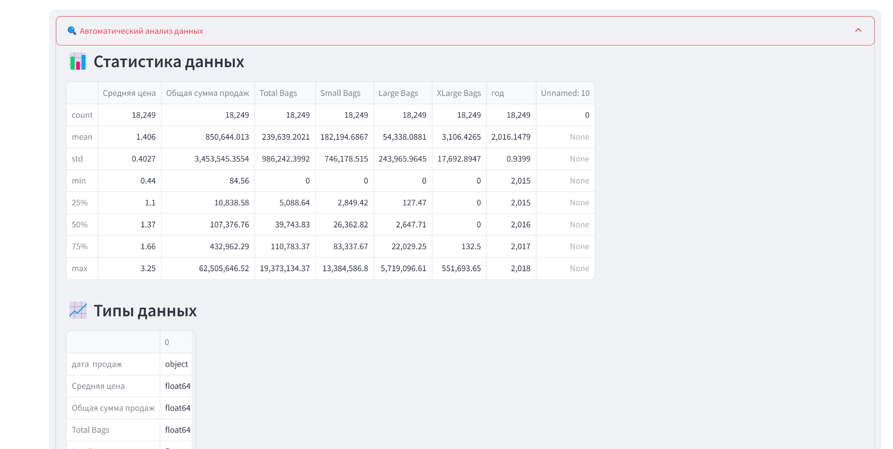
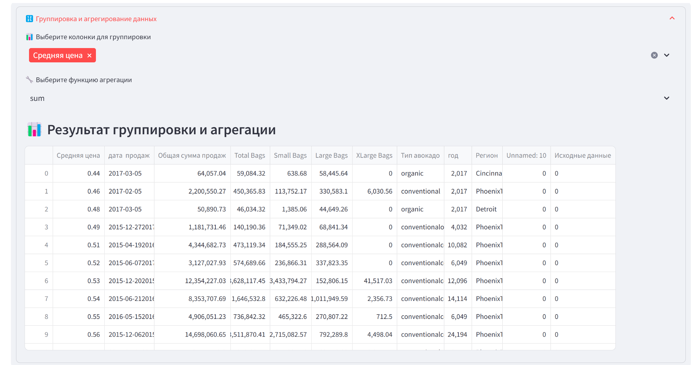
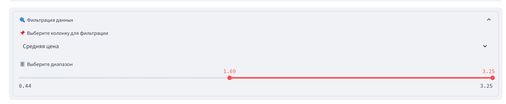
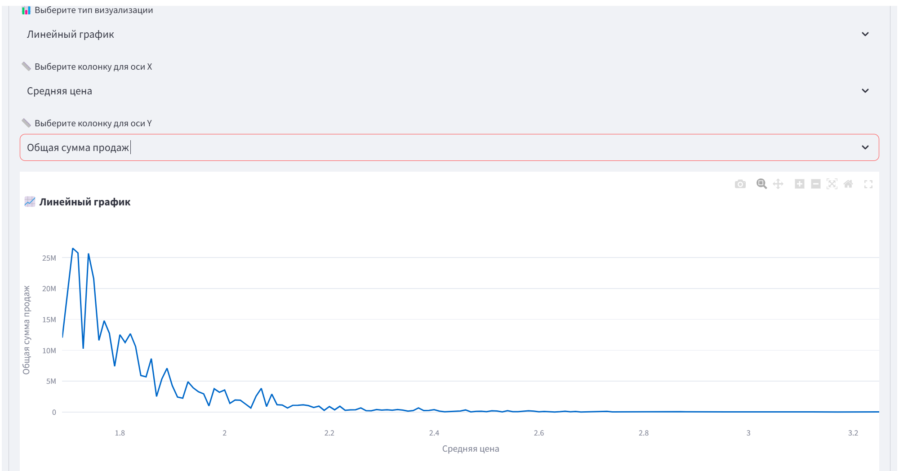
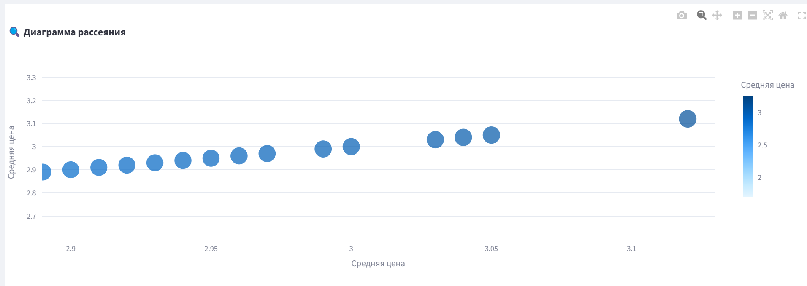

# Лабораторная работа 2

## Тема: "Интерактивный визуализатор данных"

## Цель работы

 Загрузка данных в табличном формате и отображение результатов в виде графиков и диаграмм для последующего анализа

## Основные требования

1. Интерфейс пользователя:
    - Возможность загрузки файлов данных (например, CSV, Excel).
    - Меню для выбора типов визуализации (линейные графики, гистограммы, диаграммы рассеяния и т.д.).
    - Интерактивные элементы управления (фильтры, ползунки, выпадающие списки и т.д.) для изменения параметров визуализации.
2. Обработка данных:
    - Импорт данных из загруженных файлов + визуализация данных в форме таблицы.
    - Обработка и очистка данных (например, устранение пропущенных значений, нормализация).
    - Возможность группировки и агрегирования данных.
3. Алгоритмы визуализации:
    - Реализация различных типов визуализаций (линейные графики, гистограммы, диаграммы рассеяния, круговые диаграммы и т.д.).
    - Возможность динамического обновления визуализаций при изменении параметров.
    - Интерактивные графики (увеличение, уменьшение, выделение отдельных элементов).
4. Функциональные возможности:
    - Возможность экспорта визуализаций в виде изображений (PNG, JPEG) или PDF.
    - Встроенные пояснения и подсказки для пользователей.

    


 

## Код программы

```
import streamlit as st
import pandas as pd
import plotly.express as px
from streamlit_plotly_events import plotly_events


st.title("Интерактивный визуализатор данных")

uploaded_file = st.file_uploader("Загрузите файл данных (CSV или Excel)", type=["csv", "xlsx"])

st.info("Поддерживаются файлы CSV и Excel. Для CSV можно выбрать разделитель.")

if uploaded_file and uploaded_file.name.endswith('.csv'):
    delimiter = st.text_input("Введите разделитель для CSV-файла (по умолчанию запятая)", ",")
else:
    delimiter = ","

if uploaded_file is not None:
    if uploaded_file.name.endswith('.csv'):
        df = pd.read_csv(uploaded_file, delimiter=delimiter)
    else:
        df = pd.read_excel(uploaded_file, engine='openpyxl')

    st.write("### Данные")
    st.write(df)

    st.write("### Очистка данных")
    if st.checkbox("Удалить строки с пропущенными значениями"):
        df = df.dropna()
        st.success("Строки с пропущенными значениями удалены.")
    if st.checkbox("Нормализовать данные"):
        df = (df - df.mean()) / df.std()
        st.success("Данные нормализованы.")

    st.write("### Группировка и агрегирование данных")
    group_by = st.multiselect("Выберите колонки для группировки", df.columns.tolist())
    if group_by:
        agg_func = st.selectbox("Выберите функцию агрегации", ["sum", "mean", "count", "min", "max"])
        df_grouped = df.groupby(group_by).agg(agg_func).reset_index()
        st.write("### Результат группировки и агрегации")
        st.write(df_grouped)
        df = df_grouped

    st.write("### Фильтрация данных")
    filter_column = st.selectbox("Выберите колонку для фильтрации", df.columns.tolist())
    if df[filter_column].dtype in ["int64", "float64"]:
        min_val, max_val = float(df[filter_column].min()), float(df[filter_column].max())
        filter_range = st.slider("Выберите диапазон", min_val, max_val, (min_val, max_val))
        df = df[(df[filter_column] >= filter_range[0]) & (df[filter_column] <= filter_range[1])]
    else:
        filter_value = st.selectbox("Выберите значение для фильтрации", df[filter_column].unique())
        df = df[df[filter_column] == filter_value]

    st.write("### Выбор типа визуализации")
    chart_type = st.selectbox(
        "Выберите тип визуализации",
        ["Линейный график", "Гистограмма", "Диаграмма рассеяния", "Круговая диаграмма"]
    )

    columns = df.columns.tolist()
    x_axis = st.selectbox("Выберите колонку для оси X", columns)
    y_axis = st.selectbox("Выберите колонку для оси Y", columns) if chart_type != "Круговая диаграмма" else None

    if chart_type == "Диаграмма рассеяния":
        color_column = st.selectbox("Выберите колонку для цвета", columns)
        size_column = st.selectbox("Выберите колонку для размера точек", columns)
    else:
        color_column = None
        size_column = None

    if chart_type == "Линейный график":
        fig = px.line(df, x=x_axis, y=y_axis, title="Линейный график")
    elif chart_type == "Гистограмма":
        fig = px.histogram(df, x=x_axis, title="Гистограмма")
    elif chart_type == "Диаграмма рассеяния":
        fig = px.scatter(df, x=x_axis, y=y_axis, color=color_column, size=size_column, title="Диаграмма рассеяния")
    elif chart_type == "Круговая диаграмма":
        fig = px.pie(df, names=x_axis, title="Круговая диаграмма")

    st.plotly_chart(fig)

    selected_points = plotly_events(fig, select_event=True)

    st.write("### Выделенные данные")
    if selected_points:
        selected_indices = [p["pointIndex"] for p in selected_points]
        selected_data = df.iloc[selected_indices]
        st.write(selected_data)
    else:
        st.write("Выделите данные на графике.")

    st.write("### Пояснения")
    st.markdown("""
    - **Линейный график**: Используется для отображения изменений данных во времени.
    - **Гистограмма**: Показывает распределение данных.
    - **Диаграмма рассеяния**: Используется для выявления взаимосвязей между двумя переменными.
    - **Круговая диаграмма**: Показывает доли категорий в общем объеме данных.
    - **Выделение данных**: Используйте инструмент выделения (лассо или прямоугольник) на графике, чтобы выделить интересующие вас точки данных.
    """)

else:
    st.write("Пожалуйста, загрузите файл данных для начала работы.")import streamlit as st
import pandas as pd
import plotly.express as px
from streamlit_plotly_events import plotly_events
import base64
from io import BytesIO

st.set_page_config(page_title="📊 DataViz Pro", page_icon="📊", layout="wide")

st.markdown(
    """
    <style>
    .stButton button {
        background-color: #4CAF50;
        color: white;
        border-radius: 5px;
        padding: 10px 20px;
    }
    .stExpander {
        background-color: #f0f2f6;
        border-radius: 10px;
        padding: 10px;
    }
    .stMarkdown h1 {
        color: #2e86c1;
    }
    </style>
    """,
    unsafe_allow_html=True,
)

st.title("📊 Интерактивный визуализатор данных")

uploaded_file = st.file_uploader("📂 Загрузите файл данных (CSV или Excel)", type=["csv", "xlsx"])

st.info("ℹ️ Поддерживаются файлы CSV и Excel. Для CSV можно выбрать разделитель.")

if uploaded_file is not None:
    if uploaded_file.name.endswith('.csv'):
        delimiter = st.text_input("✏️ Введите разделитель для CSV-файла (по умолчанию запятая)", ",")
    else:
        delimiter = ","

    if uploaded_file.name.endswith('.csv'):
        df = pd.read_csv(uploaded_file, delimiter=delimiter)
    else:
        df = pd.read_excel(uploaded_file, engine='openpyxl')

    with st.expander("📄 Ваши данные", expanded=True):
        st.dataframe(df)

        csv = df.to_csv(index=False)
        b64 = base64.b64encode(csv.encode()).decode()
        st.markdown(
            f'<a href="data:file/csv;base64,{b64}" download="data.csv">⬇️ Скачать данные в формате CSV</a>',
            unsafe_allow_html=True,
        )

    with st.expander("🔍 Автоматический анализ данных", expanded=False):
        st.write("### 📊 Статистика данных")
        st.write(df.describe())

        st.write("### 📈 Типы данных")
        st.write(df.dtypes)

    with st.expander("🧹 Очистка и нормализация данных", expanded=False):
        col1, col2 = st.columns(2)
        with col1:
            if st.checkbox("🗑️ Удалить строки с пропущенными значениями"):
                df = df.dropna()
                st.success("✅ Строки с пропущенными значениями удалены.")
        with col2:
            if st.checkbox("📏 Нормализовать данные"):
                df = (df - df.mean()) / df.std()
                st.success("✅ Данные нормализованы.")

    with st.expander("🔢 Группировка и агрегирование данных", expanded=False):
        group_by = st.multiselect("📊 Выберите колонки для группировки", df.columns.tolist())
        if group_by:
            agg_func = st.selectbox("🔧 Выберите функцию агрегации", ["sum", "mean", "count", "min", "max"])
            df_grouped = df.groupby(group_by).agg(agg_func).reset_index()
            st.write("### 📊 Результат группировки и агрегации")
            st.dataframe(df_grouped)
            df = df_grouped

    with st.expander("🔍 Фильтрация данных", expanded=False):
        filter_column = st.selectbox("📌 Выберите колонку для фильтрации", df.columns.tolist())
        if df[filter_column].dtype in ["int64", "float64"]:
            min_val, max_val = float(df[filter_column].min()), float(df[filter_column].max())
            filter_range = st.slider("🎚️ Выберите диапазон", min_val, max_val, (min_val, max_val))
            df = df[(df[filter_column] >= filter_range[0]) & (df[filter_column] <= filter_range[1])]
        else:
            filter_value = st.selectbox("🎯 Выберите значение для фильтрации", df[filter_column].unique())
            df = df[df[filter_column] == filter_value]

    with st.expander("📈 Выберите тип визуализации", expanded=False):
        chart_type = st.selectbox(
            "📊 Выберите тип визуализации",
            ["Линейный график", "Гистограмма", "Диаграмма рассеяния", "Круговая диаграмма", "Тепловая карта"]
        )

        columns = df.columns.tolist()
        x_axis = st.selectbox("📏 Выберите колонку для оси X", columns)
        y_axis = st.selectbox("📏 Выберите колонку для оси Y", columns) if chart_type != "Круговая диаграмма" else None

        if chart_type == "Диаграмма рассеяния":
            color_column = st.selectbox("🎨 Выберите колонку для цвета", columns)
            size_column = st.selectbox("🔍 Выберите колонку для размера точек", columns)
        else:
            color_column = None
            size_column = None

        if chart_type == "Линейный график":
            fig = px.line(df, x=x_axis, y=y_axis, title="📈 Линейный график")
        elif chart_type == "Гистограмма":
            fig = px.histogram(df, x=x_axis, title="📊 Гистограмма")
        elif chart_type == "Диаграмма рассеяния":
            fig = px.scatter(df, x=x_axis, y=y_axis, color=color_column, size=size_column, title="🔍 Диаграмма рассеяния")
        elif chart_type == "Круговая диаграмма":
            fig = px.pie(df, names=x_axis, title="🍕 Круговая диаграмма")
        elif chart_type == "Тепловая карта":
            fig = px.imshow(df.corr(), title="🔥 Тепловая карта корреляции")

        st.plotly_chart(fig, use_container_width=True)

        selected_points = plotly_events(fig, select_event=True)
        st.write("### 📌 Выделенные данные")
        if selected_points:
            selected_indices = [p["pointIndex"] for p in selected_points]
            selected_data = df.iloc[selected_indices]
            st.dataframe(selected_data)
        else:
            st.info("ℹ️ Выделите данные на графике с помощью инструмента выделения (лассо или прямоугольник).")

    st.markdown("---")  # Разделитель
    with st.expander("📚 Узнайте больше о графиках", expanded=True):
        st.markdown(
            """
            <style>
            .transparent-text {
                color: rgba(0, 0, 0, 0.6);  /* Полупрозрачный текст */
                font-size: 0.9em;
            }
            </style>
            <div class="transparent-text">
            📈 Линейный график: Используется для отображения изменений данных во времени.<br>
            📊 Гистограмма: Показывает распределение данных.<br>
            🔍 Диаграмма рассеяния: Используется для выявления взаимосвязей между двумя переменными.<br>
            🍕 Круговая диаграмма: Показывает доли категорий в общем объеме данных.<br>
            🔥 Тепловая карта: Показывает корреляцию между переменными.<br>
            📌 Выделение данных: Используйте инструмент выделения (лассо или прямоугольник) на графике, чтобы выделить интересующие вас точки данных.
            </div>
            """,
            unsafe_allow_html=True
        )

else:
    st.warning("⚠️ Пожалуйста, загрузите файл данных для начала работы.")
    
    Запуск: streamlit run main.py

```
 
## Результаты работы

 Интерфейс при запуске. Выполнено - Возможность загрузки файлов данных (например, CSV, Excel).
 Интерфейс при загрузке файла данных.Выполнено Импорт данных из загруженных файлов + визуализация данных в форме таблицы.
 Интерфейс при загрузке файла данных (функциональные возможности выпадающими списками. Данные и Узнайте больше о графиках открыты при запсуке).
 Функциональные возможности.Автоматический анализ данных
 Функциональные возможности.Очистка и нормализация данных.Выполнено Обработка и очистка данных (например, устранение пропущенных значений, нормализация).
 Функциональные возможности.Группировка и агрегирование данных.Выполнено Возможность группировки и агрегирования данных.
 Функциональные возможности.Фильтрация данных.Выполнено Интерактивные элементы управления (фильтры, ползунки, выпадающие списки и т.д.) для изменения параметров визуализации.
 Функциональные возможности.Выбор типа визуализации.Выполнено Меню для выбора типов визуализации (линейные графики, гистограммы, диаграммы рассеяния и т.д.).
 Функциональные возможности.Выбор типа визуализации.Диаграмма рассеяния.Выполнено - Возможность динамического обновления визуализаций при изменении параметров.
Функциональные возможности.Выбор типа визуализации.Диаграмма рассеяния.Выделение данных.Выполнено - Интерактивные графики (увеличение, уменьшение, выделение отдельных элементов).
 
Функциональные возможности.Выделенные данные
 Функциональные возможности.Узнайте больше о графиках.Выполнено - Встроенные пояснения и подсказки для пользователей.
Функциональные возможности.Выбор типа визуализации.Диаграмма рассеяния.- Возможность экспорта визуализаций в виде изображений (PNG, JPEG) или PDF. 


 
