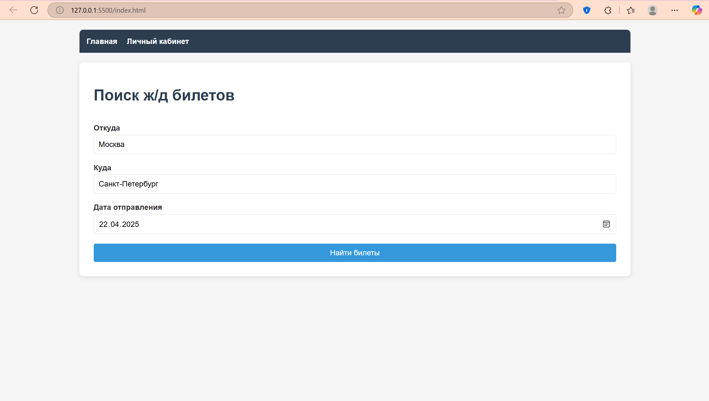
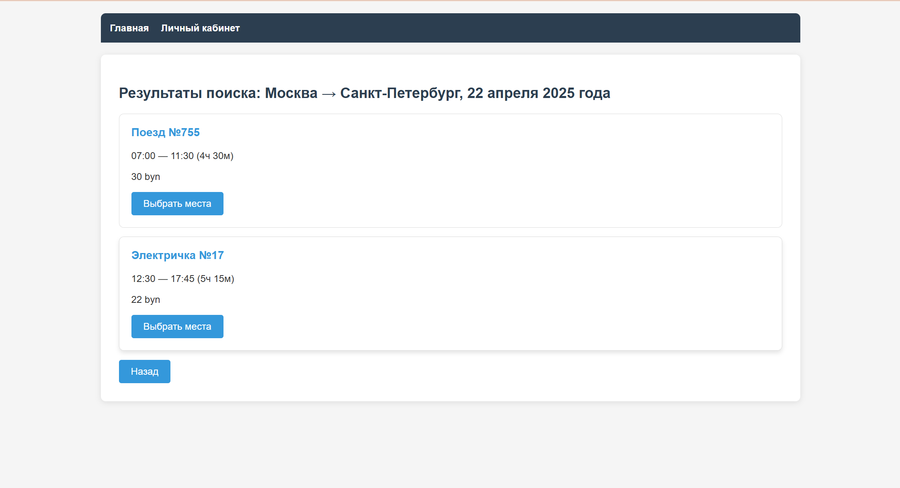
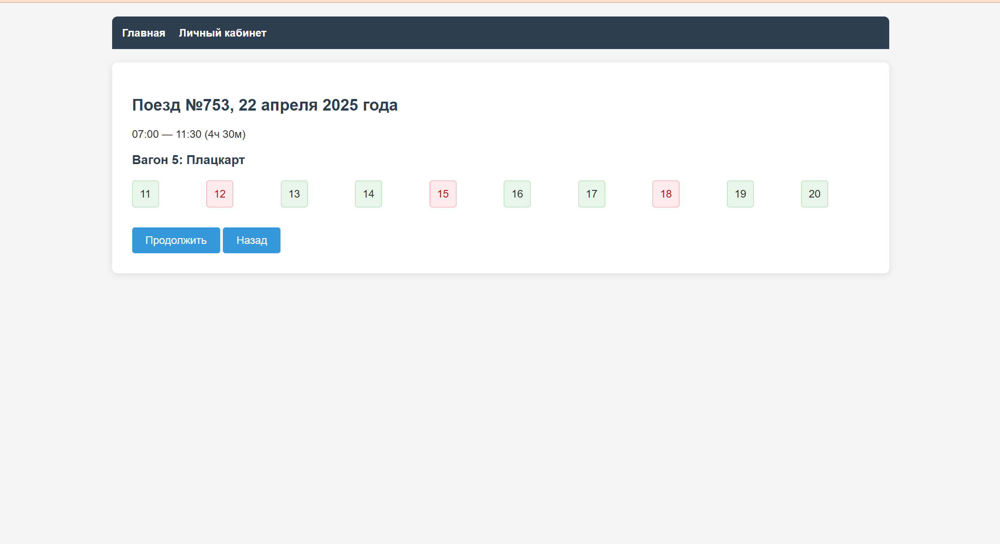
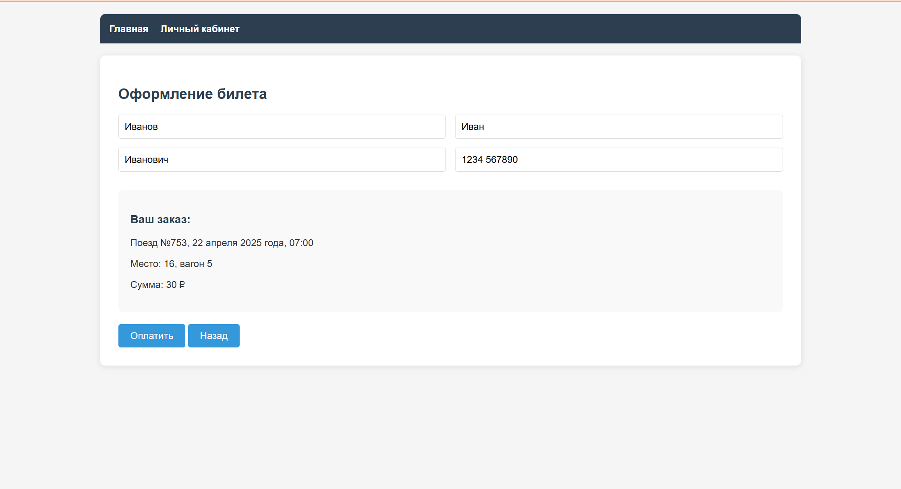
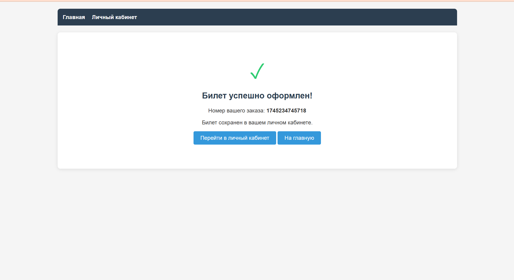
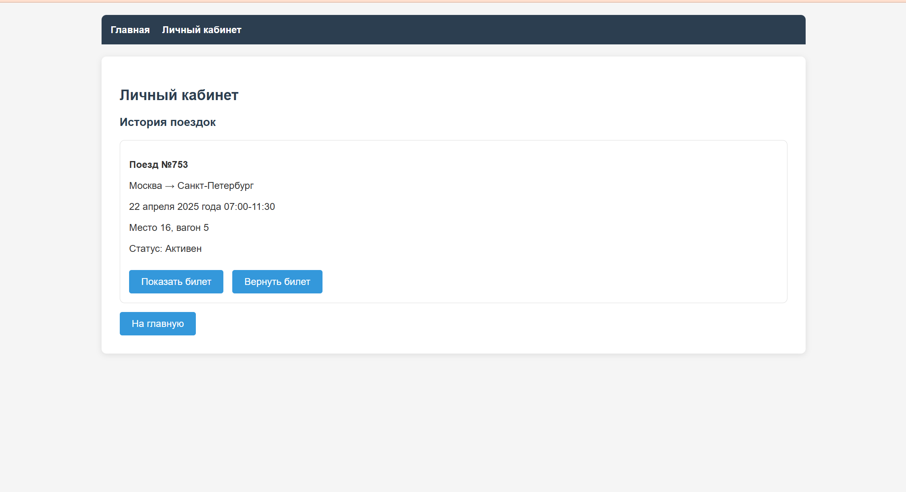
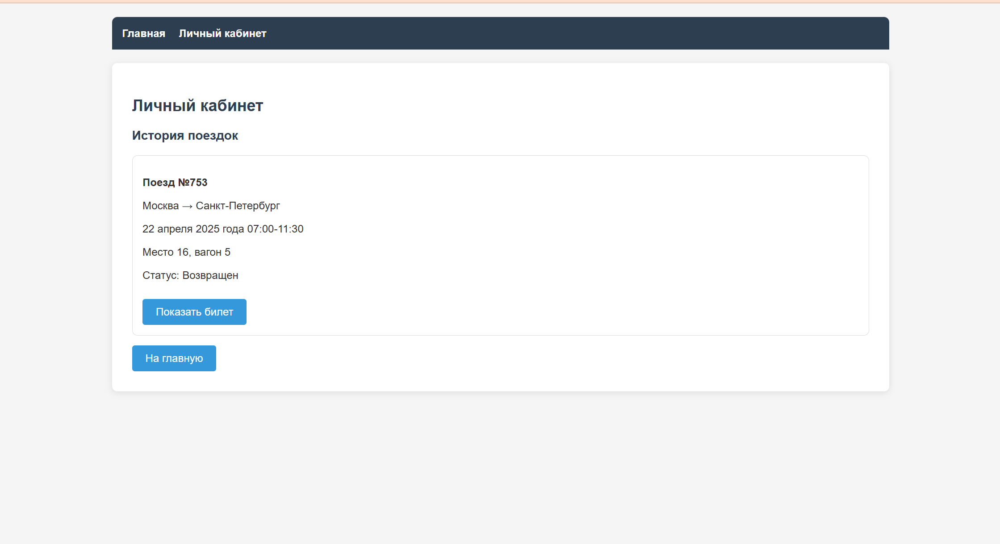

# Лабораторная работа 3

## Тема: "Создание высокоуровневого макета сайта"

## Цель работы

Cайт представляет собой макет высокого уровня без функциональной части. Реализовать возможность демонстрации работы сайта, заполняя поля необходимой информацией и демонстрируя переходы между страницами сайта.

## Задача

Сайт купли-продажи билетов на ЖД.

## Требования

Основные страницы:
  • Главная страница: Поиск маршрутов по направлениям, даты и времени.
  
  • Результаты поиска: Список доступных поездов с возможностью выбора
мест.

  • Подтверждение заказа: Форма для ввода данных пассажира и оформления
билета.

  • Личный кабинет: Просмотр истории поездок или возврат билетов

## Результаты работы

Интерфейс

