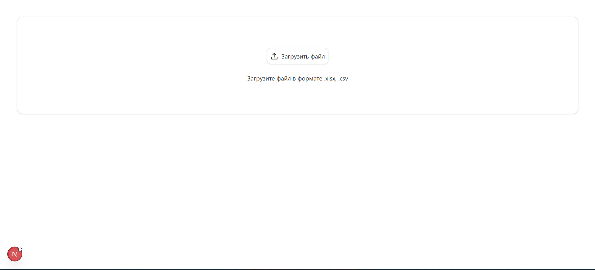
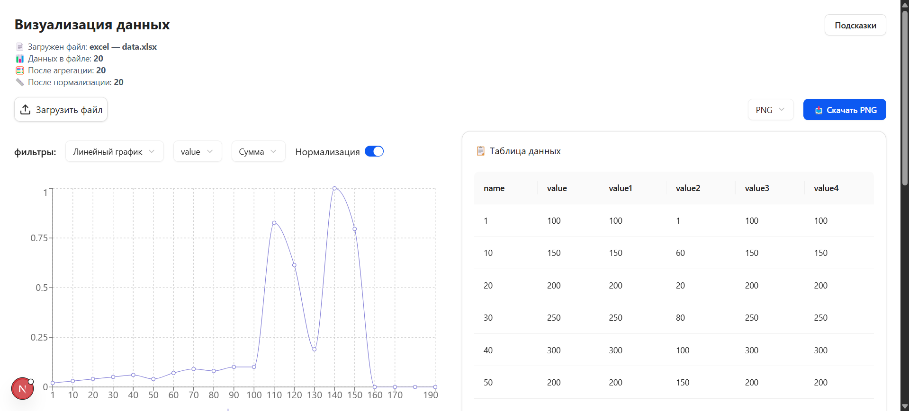
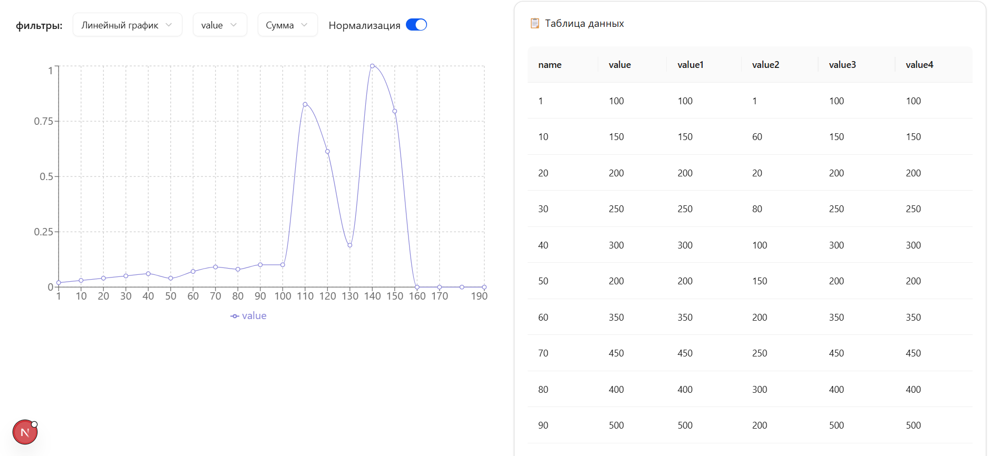
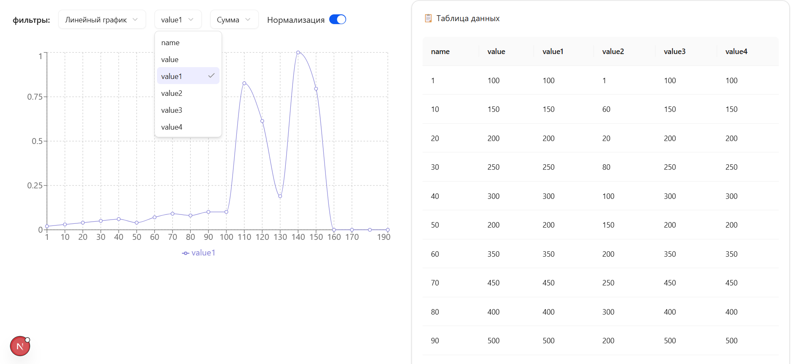
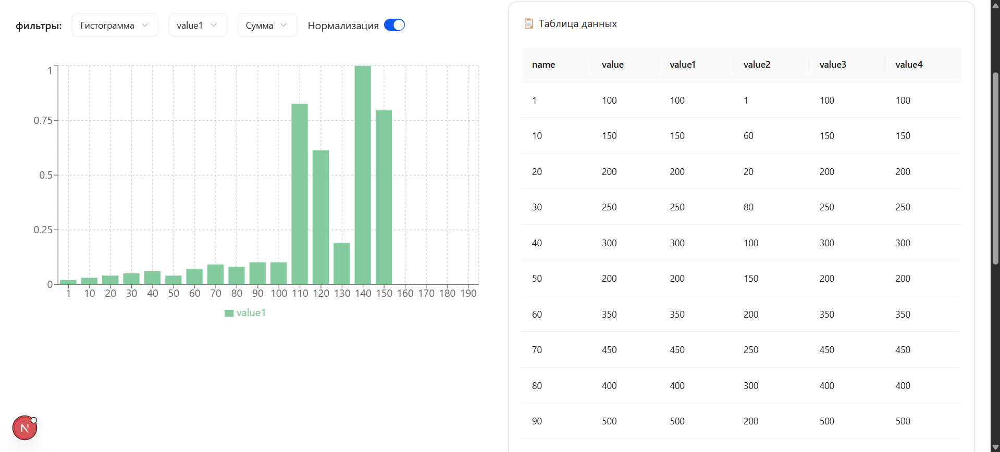
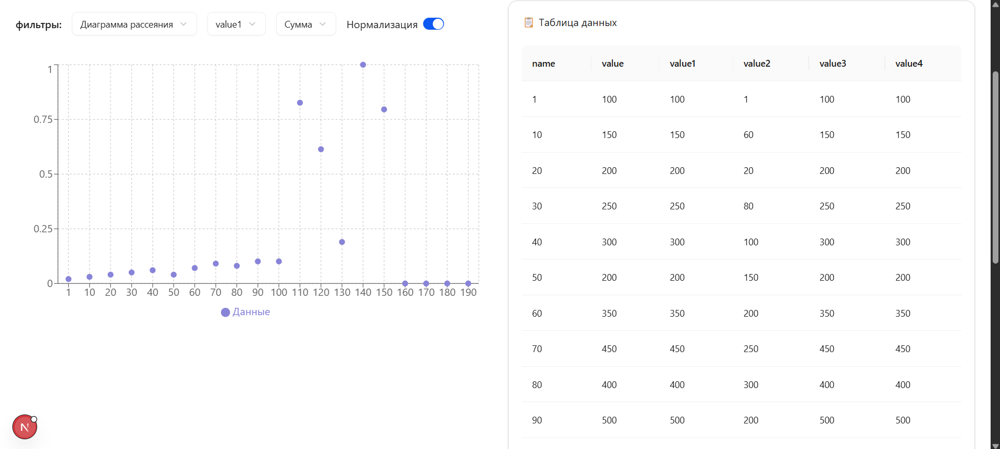
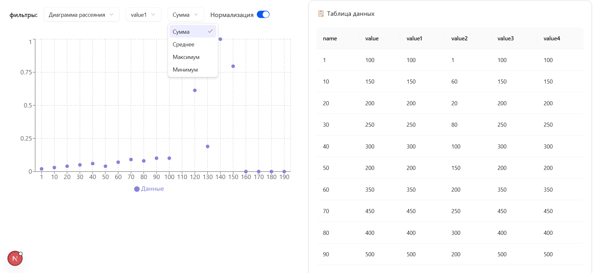
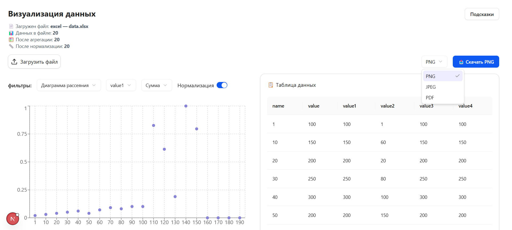

## Тема: "Интерактивный визуализатор данных"

**Выполнил:**
Студент 3 курса, группы ИИ-23  
Швороб В.А.

**Проверила:**
Ситковец Я.С.

12 вариант

## Цель работы

 Загрузка данных в табличном формате и отображение результатов в виде графиков и диаграмм для последующего анализа

## Основные требования

1. Интерфейс пользователя:
    - Возможность загрузки файлов данных (например, CSV, Excel).
    - Меню для выбора типов визуализации (линейные графики, гистограммы, диаграммы рассеяния и т.д.).
    - Интерактивные элементы управления (фильтры, ползунки, выпадающие списки и т.д.) для изменения параметров визуализации.
2. Обработка данных:
    - Импорт данных из загруженных файлов + визуализация данных в форме таблицы.
    - Обработка и очистка данных (например, устранение пропущенных значений, нормализация).
    - Возможность группировки и агрегирования данных.
3. Алгоритмы визуализации:
    - Реализация различных типов визуализаций (линейные графики, гистограммы, диаграммы рассеяния, круговые диаграммы и т.д.).
    - Возможность динамического обновления визуализаций при изменении параметров.
    - Интерактивные графики (увеличение, уменьшение, выделение отдельных элементов).
4. Функциональные возможности:
    - Возможность экспорта визуализаций в виде изображений (PNG, JPEG) или PDF.
    - Встроенные пояснения и подсказки для пользователей.

    
Оценка работы:
Для оценки работы в 4-5 баллов, нужно выполнить все Зеленые пункты.
Для оценки работы в 7-8 баллов, нужно дополнительно выполнить Бирюзовые пункты. Их всего 4, можно взять любые 3. 
Для оценки в 9-10 нужно выполнить Фиолетовые пункты. Их всего 2.
Итоговая оценка за работу складывается из числа выполненных требований к работе. Обязательными считаются зеленые, все остальные повышают итоговую оценку за работу. 


## Результаты работы

#### Стек-frontend:
- Библиотека и язык: Next.js, TypeScript;
- UI-components: Shadcn/ui, Antd, recharts (графики);
- Стилизация: Tailwind.

Установка необходимых пакетов:
``` bash
npm install
```

Запуск проекта:
``` shell
npm run dev
```

### Интерфейс

Стартовай экран:


Файл загружен. Выведены данные о файле. График + фильтры. Таблица: 

Линейный график + данные файла в виде таблицы:


Фильтр вывода разных столбцов файла:


Фильтр 'Гистограмма':


Фильтр 'ДиаграммаРассеивания':


Фильтр 'Агрегация данных':


Фильтр 'Нормализация':


Блок подсказки:


Возможность экспорта визуализаций в виде изображений:
