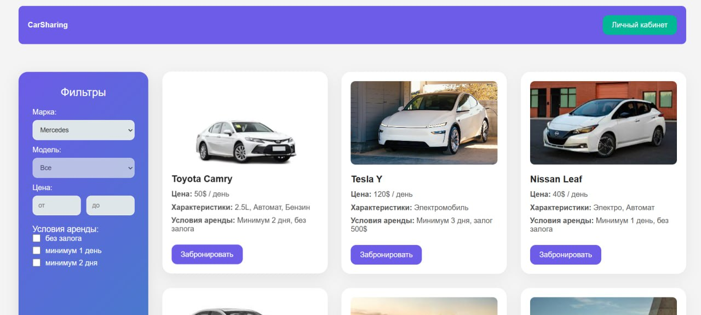
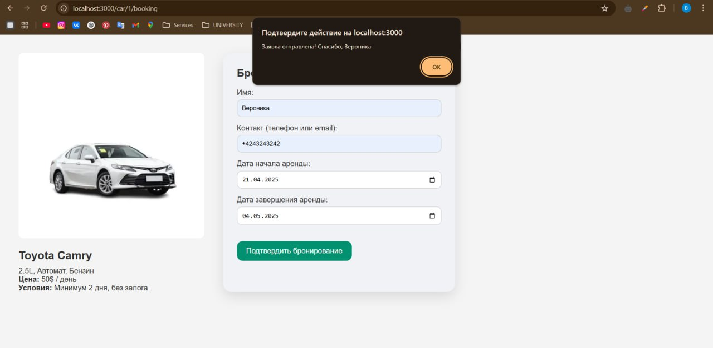

# Лабораторная работа 3

## Тема: "Создание высокоуровневого макета сайта"

**Выполнила:**
Студентка 3 курса, группы ИИ-23  
Новицкая В. Д.

**Проверила:**
Ситковец Я.С.

6 вариант

## Цель работы

 Cайт представляет собой макет высокого уровня без функциональной части. Реализовать возможность демонстрации работы сайта, заполняя поля необходимой информацией и демонстрируя переходы между страницами сайта.

##Задача

Сайт аренды авто

## Требования

Основные страницы:   
• Главная страница: Список автомобилей с основными параметрами (марка,
модель, цена, характеристики).
• Детальная страница автомобиля: Подробное описание выбранного
автомобиля, фото, условия аренды.
• Форма бронирования: Заполнение данных клиента (имя, контакты, дата
начала и завершения аренды).
• Личный кабинет: Просмотр истории бронирования и управление текущими
заказами.
 
## Результаты работы

Интерфейс
 
 
 
 
