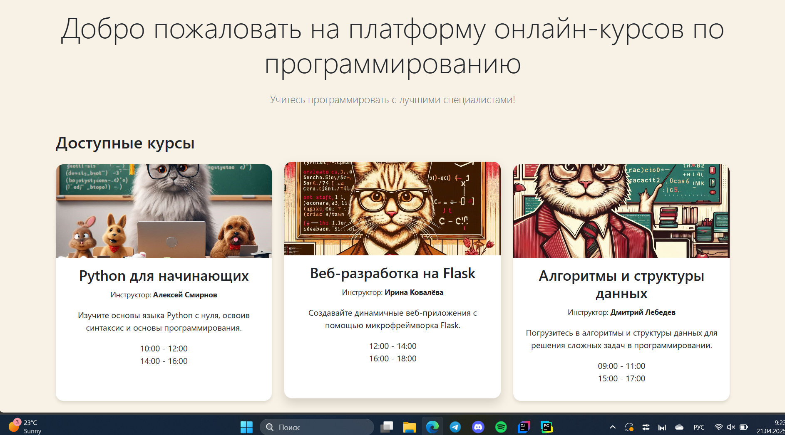
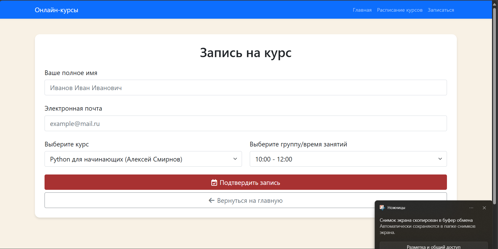
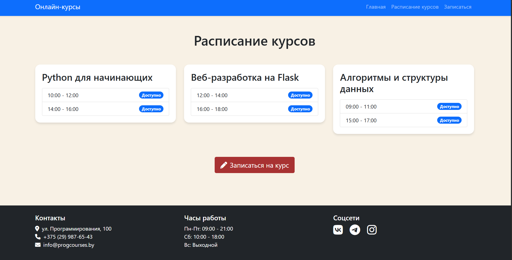

# Лабораторная работа 3

## Тема: "Создание высокоуровневого макета сайта"

## Цель работы

 Cайт представляет собой макет высокого уровня без функциональной части. Реализовать возможность демонстрации работы сайта, заполняя поля необходимой информацией и демонстрируя переходы между страницами сайта.

##Задача

Сайт поликлиники

## Требования

Основные страницы: 
 • Главная страница: Информация о доступных курсах.
 • Расписание: Список доступных временных слотов для записи.
 • Запись на прием: Форма для ввода данных учащегося и выбора времени.
 • Подтверждение: Сведения о записи с возможностью отмены.

## Код программы

```
import os
from flask import Flask, render_template, request, redirect, url_for
from sendgrid import SendGridAPIClient
from sendgrid.helpers.mail import Mail

app = Flask(__name__, template_folder=os.path.join(os.getcwd(), 'templates'))
SENDGRID_API_KEY = os.getenv("SENDGRID_API_KEY")

# Список курсов: здесь для поля image указан относительный путь
COURSES = [
    {
        "title": "Python для начинающих",
        "instructor": "Алексей Смирнов",
        "image": "images/python_course.jpeg",
        "description": "Изучите основы языка Python с нуля, освоив синтаксис и основы программирования."
    },
    {
        "title": "Веб-разработка на Flask",
        "instructor": "Ирина Ковалёва",
        "image": "images/flask_course.jpeg",
        "description": "Создавайте динамичные веб-приложения с помощью микрофреймворка Flask."
    },
    {
        "title": "Алгоритмы и структуры данных",
        "instructor": "Дмитрий Лебедев",
        "image": "images/algorithms_course.jpeg",
        "description": "Погрузитесь в алгоритмы и структуры данных для решения сложных задач в программировании."
    },
]

# Расписание курсов (для каждого курса указаны доступные группы/время занятий)
COURSE_SCHEDULE = {
    "Python для начинающих": ["10:00 - 12:00", "14:00 - 16:00"],
    "Веб-разработка на Flask": ["12:00 - 14:00", "16:00 - 18:00"],
    "Алгоритмы и структуры данных": ["09:00 - 11:00", "15:00 - 17:00"],
}

enrollments = []


@app.route('/')
def index():
    return render_template("index.html", courses=COURSES, schedule=COURSE_SCHEDULE)


@app.route('/schedule')
def schedule():
    return render_template("schedule.html", schedule=COURSE_SCHEDULE)


@app.route('/enroll', methods=['GET', 'POST'])
def enroll():
    if request.method == 'POST':
        student_name = request.form['name']
        email = request.form['email']
        course_title = request.form['course']
        group_time = request.form['time']
        enrollment = {
            "name": student_name,
            "email": email,
            "course": course_title,
            "time": group_time
        }
        enrollments.append(enrollment)

        msg = Mail(
            from_email="your_email@example.com",
            to_emails=email,
            subject="Подтверждение записи на курс",
            plain_text_content=(
                f"Здравствуйте, {student_name}!\n\n"
                f"Вы успешно записаны на курс \"{course_title}\" "
                f"в группе {group_time}.\n\nУспехов в обучении!"
            )
        )

        try:
            sg = SendGridAPIClient(SENDGRID_API_KEY)
            response = sg.send(msg)
            print(f"Email отправлен! Статус: {response.status_code}")
        except Exception as e:
            print(f"Ошибка при отправке письма: {e}")

        enrollment_index = len(enrollments) - 1
        return redirect(url_for('confirmation', name=student_name, course=course_title, time=group_time, enrollment_index=enrollment_index))

    return render_template("enroll.html", courses=COURSES, schedule=COURSE_SCHEDULE)


@app.route('/confirmation')
def confirmation():
    student_name = request.args.get('name')
    course = request.args.get('course')
    group_time = request.args.get('time')
    enrollment_index = int(request.args.get('enrollment_index'))
    return render_template("confirmation.html", name=student_name, course=course, time=group_time, enrollment_index=enrollment_index)


@app.route('/cancel_enrollment/<int:index>', methods=['GET'])
def cancel_enrollment(index):
    if 0 <= index < len(enrollments):
        canceled_enrollment = enrollments.pop(index)
        msg = Mail(
            from_email="your_email@example.com",
            to_emails=canceled_enrollment['email'],
            subject="Отмена записи на курс",
            plain_text_content=(
                f"Здравствуйте, {canceled_enrollment['name']}!\n\n"
                f"Ваша запись на курс \"{canceled_enrollment['course']}\" в группе {canceled_enrollment['time']} была отменена."
            )
        )
        try:
            sg = SendGridAPIClient(SENDGRID_API_KEY)
            response = sg.send(msg)
            print(f"Email об отмене отправлен! Статус: {response.status_code}")
        except Exception as e:
            print(f"Ошибка при отправке письма: {e}")

    return redirect(url_for('index'))


if __name__ == '__main__':
    app.run(debug=True)

```
 
## Результаты работы

Интерфейс
 
 
 

